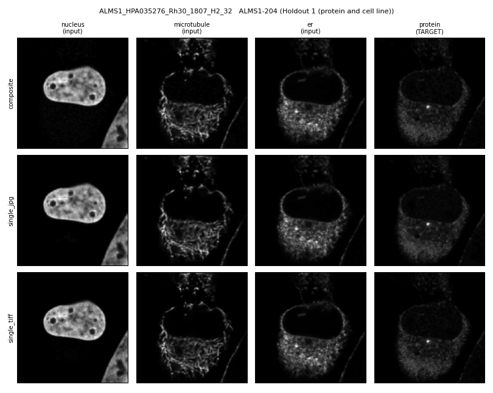

# Example run-through — from a clean machine to figures

A transcript of one complete run of this pipeline on a machine that had none of it
installed, captured so that anyone reproducing it can compare their output line by line
and know what "working" looks like.

All output is **verbatim**. The only edits are the shell prompt, shortened to `$`, and
repetitive per-gene blocks, elided with an explicit `[...]` marker. Annotations are indicated
as *What to check* and are not part of the output.

- **Date** 2026-09-16
- **Host** Linux, 8 CPU threads, no GPU
- **Directory** `~/Projects/PUPS_Example_fresh`, verbatim copy of the git repository before this run
- **Track** `Fig_2C` — 14 fields of view, 6 genes, the cheapest track to run first.
  A [second track](#a-second-example-track-unattended--fig_ext5b-via-run_tracksh) follows, run in one
  command instead of step by step.
- **Python** 3.10.12

## Progress

| Step | What it does | Status |
|---|---|---|
| setup | clone PUPS + image tooling, venv, checkpoints | done, output not captured |
| 1 | model identity gate | **passed** |
| 2 `--self-test` | proteoform resolution gate | **passed** |
| 2 | resolve proteoforms for the track | **6/6 resolved** |
| 3 | provenance | **passed**, 30 URLs logged |
| 4 | download images | **14 fields of view, fork verified** |
| 4b | image completeness gate | **passed**, 14/14 complete |
| 5 | ESM-2 embeddings | **6/6, `--faithful`, 0 truncated** |
| 6 | build the three stacks | **14 tiles written** |
| 7 | PUPS inference, 6 conditions per tile | **84 forward passes, 4 s** |
| 8 | metrics | **84 + 168 rows scored** |
| 9 | Panel A figures | **6/6 genes, no truncation** |
| 9b | Panel A over every tile | **14 tiles, 2 pages** |
| 10 | Panel B figures, threshold 0 and 1 | **6 figures, both thresholds** |
| 11 | channel ablation | **14 tiles, 5 conditions each** |
| 12 | comparison matrix | **6 examples, figure written** |

---

## Setup

```
$ # ── setup (once) ──────────────────────────────────────────────────────────────
git clone <this-repo> && cd PUPS_Examples

git clone https://github.com/uhlerlab/PUPS.git PUPS_Code
git -C PUPS_Code checkout e0354b9e6374c1f6676fcbc9d9c15ca6c7fccd6d
git -C PUPS_Code apply "$(pwd)/patches/0001-comment-out-unused-tensorflow-import.patch"

git clone https://github.com/cellprofiling/HPA_BleedThrough_Exploration.git Image_Preparation
git -C Image_Preparation checkout 6225801e46409f9b8ab9e9274656c9dd25a5c4ad

python3 -m venv .venv && ./.venv/bin/pip install -r requirements.txt
./.venv/bin/python 0_Get_Checkpoints.py
```

Output not shared for simplicity.

---

## Gate 1 — the model is the published model

```
$ ./.venv/bin/python 1_Verify_PUPS_Model.py
========================================================================
STEP 1 — verifying PUPS runs offline on CPU
========================================================================
/home/jnhansen/Projects/PUPS_Example_fresh/PUPS_Code

------------------------------------------------------------------------
default (0.19 threshold, all paper results)
  splice_isoform_dataset_cell_line_and_gene_split_full-epoch=01-val_combined_loss=0.18.ckpt
  parameters: 5,798,400   state_dict entries: 100
  lightning 2.0.1  epoch 1  global_step 3548
  clean load: 0 missing, 0 unexpected
  forward: image (2, 1, 128, 128) ok   labels (2, 29) ok
  image value range [0.3782, 1.6449]
    note: outside [0,1] -- no output clamp in the model; step 8 decides clipping
  sequence sensitivity (mean |delta|, same image, different embedding): 0.042870
  throughput: 58 ms/sample on 8 threads  ->  120 tiles x 6 conditions = 42 s

------------------------------------------------------------------------
nothreshold (ablation, Extended Data Fig. 5b top panel)
  nothreshold.ckpt
  parameters: 5,798,400   state_dict entries: 100
  lightning 2.0.1  epoch 0  global_step 2661
  clean load: 0 missing, 0 unexpected
  forward: image (2, 1, 128, 128) ok   labels (2, 29) ok
  image value range [0.5137, 2.8074]
    note: outside [0,1] -- no output clamp in the model; step 8 decides clipping
  sequence sensitivity (mean |delta|, same image, different embedding): 0.022470
  throughput: 57 ms/sample on 8 threads  ->  120 tiles x 6 conditions = 41 s

========================================================================
STEP 1 PASSED — both checkpoints load and run, no MongoDB, no GPU
  NEXT: ./.venv/bin/python 2_Resolve_Source_List.py --track <TRACK>
========================================================================
```

*What to check.* Both checkpoints must report **0 missing, 0 unexpected** — a non-zero
count means the checkpoint and the model definition disagree and every number downstream
is suspect. `parameters: 5,798,400` and `state_dict entries: 100` should match exactly;
they are properties of the published architecture, not of this machine. **Sequence
sensitivity must be non-zero**: it feeds the same image with two different protein
embeddings and measures the change, so a zero would mean the protein sequence is being
ignored and the whole comparison is meaningless. Predictions leaving `[0, 1]` is expected —
the model has no output clamp, and step 8 decides what to do about it.

Only the two throughput lines are machine-specific.

---

## Gate 2 — our proteoform chain reproduces the authors' own data

```
$ ./.venv/bin/python 2_Resolve_Source_List.py --self-test
SELF-TEST — reproduce the authors' own stored proteoform
  target: TSPAN6-201 / ENSP00000362111
  source: PUPS_Code/mongo.001_transcribed.txt (their MongoDB screenshot)

  [PASS] sequence retrieved
  [PASS] length == 245 aa
  [PASS] prefix matches their `sequence` field
  [PASS] L+2 == 247 (their `length` field)

  host used: https://rest.ensembl.org
  got 245 aa: MASPSRRLQTKPVITCFKSVLLIYTFIFWITGVILLAVGIWGKVSLENYFSLLNEKATNV

SELF-TEST PASSED — our chain reproduces their data.
```

*What to check.* All four `[PASS]` lines. This resolves one proteoform the authors
published a database screenshot of, and requires our independent Ensembl lookup to return
their stored sequence, their length, and their `L+2` convention. It is the check that our
sequence input is theirs and not merely something plausible. It needs network access to
`rest.ensembl.org`.

---

## Step 2 — resolve which proteoform each target is

```
$ # ── one track, end to end.  Fig_2C is the cheapest and cleanest to start with ──
T=Fig_2C            # or Fig_Ext5B, or Independent_Selection

$ ./.venv/bin/python 2_Resolve_Source_List.py    --track $T
STEP 2 — 6 row(s) in Fig_2C, mode=label, via HPA -> ENSP -> Ensembl

[1/6] DUSP27-203  (Rh30)
    ENSG00000198842 (STYXL2)  HPA lists 3 ENSP(s) [ok]
    ENSP00000404874  1158 aa  [ensp_override in source_list.csv]
[2/6] AMPD3-209  (PC3)
    ENSG00000133805 (AMPD3)  HPA lists 7 ENSP(s) [ok]
    ENSP00000431648  767 aa  [HPA /antibody 'Matching transcripts' [AMPD3, newest=v22]]
[3/6] ALMS1-204  (Rh30)
    ENSG00000116127 (ALMS1)  HPA lists 4 ENSP(s) [ok]
    ENSP00000478155  4126 aa  [HPA /antibody 'Matching transcripts' [ALMS1, newest=v22]]
[4/6] C1QL3-202  (SHSY5Y)
    ENSG00000165985 (C1QL3)  HPA lists 2 ENSP(s) [ok]
    ENSP00000480149  213 aa  [ensp_override in source_list.csv]  via ARCHIVE feb2023 (retired ENSP)
[5/6] DYNC1LI2-201  (Rh30)
    ENSG00000135720 (DYNC1LI2)  HPA lists 6 ENSP(s) [ok]
    ENSP00000258198  492 aa  [HPA /antibody 'Matching transcripts' [DYNC1LI2, newest=v22]]
[6/6] C9orf72-205  (PC3)
    ENSG00000147894 (C9orf72)  HPA lists 6 ENSP(s) [ok]
    ENSP00000482753  481 aa  [HPA /antibody 'Matching transcripts' [C9orf72, newest=v22]]

resolved 6/6
  -> targets_resolved.tsv, sequences.json, Organelle_Example_GenesAndCellLines.txt

  1 target(s) use a RETIRED ENSP from an Ensembl archive:
    C1QL3-202        ENSP00000480149  213 aa  via https://feb2023.rest.ensembl.org
  These are the proteoforms HPA lists, so they are what PUPS read. State this.

NEXT: ./.venv/bin/python 3_Write_Provenance.py --track Fig_2C
```

*What to check.* `resolved 6/6` — anything less and the track is incomplete. Every target
must carry a **provenance tag in brackets** saying how its ENSP was chosen: either
`ensp_override in source_list.csv` (committed by hand, because HPA lists several proteoforms
for that gene and the antibody page disambiguates) or HPA's own *Matching transcripts*
field. A target resolved without a tag would mean a silent guess.

Three things in this output are worth understanding rather than skipping:

- **`STYXL2` for `DUSP27`.** HGNC moved the symbol after the paper was published, so the
  requested symbol and the returned one differ by design. The trap is that the old `DUPD1`
  separately became `DUSP29`, a *different* gene — so a naive symbol lookup can land on the
  wrong locus entirely. The resolver goes through `ENSG00000198842` and matches on the
  stable transcript number, which is why the paper's `-203` is `STYXL2-203`.
- **`via ARCHIVE feb2023 (retired ENSP)`.** Ensembl retired `ENSP00000480149`, so the
  current REST endpoint returns nothing for it and the lookup falls back to the February
  2023 archive. This is the proteoform HPA lists, and therefore the sequence PUPS was
  given — which is why the step prints "State this" rather than quietly substituting the
  current proteoform. It belongs in the methods.
- **`ALMS1-204  4126 aa`.** Over the 2000-residue limit, so this is one of the sequences
  where `--faithful` in step 5 changes what ESM-2 attention saw. Use `--faithful`.

---

## Step 3 — provenance: log every source, and cross-check it against HPA

```
$ ./.venv/bin/python 3_Write_Provenance.py       --track $T
STEP 3 — provenance for 6 target(s) in Fig_2C

  DUSP27-203
      ENSP00000404874  1158 aa  via rest   [HPA now labels it STYXL2-203 — same ENSP, label renumbered]
  AMPD3-209
      ENSP00000431648  767 aa  via rest
  ALMS1-204
      ENSP00000478155  4126 aa  via rest
  C1QL3-202
      ENSP00000480149  213 aa  via feb2023
  DYNC1LI2-201
      ENSP00000258198  492 aa  via rest
  C9orf72-205
      ENSP00000482753  481 aa  via rest

  wrote Fig_2C/PROVENANCE.tsv (30 rows) and Fig_2C/PROVENANCE.md
  all ENSPs used are listed by HPA.
```

*What to check.* The last line. **`all ENSPs used are listed by HPA`** is the pass
condition: it means every proteoform this pipeline resolved is one HPA actually serves, and
therefore one PUPS could have read. Step 3 exits non-zero when an ENSP is *not* listed —
which is a finding to read in `PROVENANCE.md`, not a reason to stop the run, and the only
step in the pipeline where a non-zero exit is informative rather than fatal.

The 30 rows are the audit trail, not a summary: each one is a single external URL with its
HTTP status, a content fingerprint and a fetch timestamp — 4 per target (HPA subcellular
page, HPA gene XML, and the Ensembl lookups) plus one per antibody/cell-line pair. Rerunning
later and diffing the fingerprints is how you detect that a source changed underneath you.

`via rest` versus `via feb2023` records which Ensembl endpoint answered, so the one archived
sequence stays visible here too rather than only in step 2's console output.

---

## Step 4 — download the images with the companion project's own tool

```
$ ./.venv/bin/python 4_Run_Image_Preparation.py  --track $T --tool download
  copied 1_HPA_Image_Download_BatchDownload.py -> Fig_2C/  (MODIFIED copy from Image_Preparation_Modified/ — verified == clone + 0001-archived-release-fallback.patch (10 hunks))

running Fig_2C/1_HPA_Image_Download_BatchDownload.py
----------------------------------------------------------------------
======================================================================
HPA Batch Image Downloader
======================================================================

Reading download list from: /home/jnhansen/Projects/PUPS_Example_fresh/Fig_2C/Organelle_Example_GenesAndCellLines.txt
Found 6 entries to process

======================================================================
Processing 1/6
======================================================================
Protein: STYXL2
Ensembl ID: ENSG00000198842
Cell Line: Rh30
Note: DUSP27-203 (Holdout 1 (protein and cell line))
Annotation saved to: /home/jnhansen/Projects/PUPS_Example_fresh/Fig_2C/STYXL2/anno.txt
Downloading XML from: https://www.proteinatlas.org/ENSG00000198842.xml
XML saved to: /home/jnhansen/Projects/PUPS_Example_fresh/Fig_2C/STYXL2/ENSG00000198842.xml
  Found 2 images for antibody HPA012912 in Rh30
  Total: Found 2 images across 1 antibodies for Rh30

  Processing Antibody: HPA012912
  Output directory: /home/jnhansen/Projects/PUPS_Example_fresh/Fig_2C/STYXL2/HPA012912/Rh30
  Downloading image 1: 1585_B4_2
  Downloading image 2: 1585_B4_3

✓ Completed STYXL2

======================================================================
Processing 2/6
======================================================================
Protein: AMPD3
Ensembl ID: ENSG00000133805
Cell Line: PC-3
Note: AMPD3-209 (Holdout 1 (protein and cell line))
Annotation saved to: /home/jnhansen/Projects/PUPS_Example_fresh/Fig_2C/AMPD3/anno.txt
Downloading XML from: https://www.proteinatlas.org/ENSG00000133805.xml
XML saved to: /home/jnhansen/Projects/PUPS_Example_fresh/Fig_2C/AMPD3/ENSG00000133805.xml
  Found 2 images for antibody HPA038662 in PC-3
  Found 2 images for antibody HPA047408 in PC-3
  Total: Found 4 images across 2 antibodies for PC-3

  Processing Antibody: HPA038662
  Output directory: /home/jnhansen/Projects/PUPS_Example_fresh/Fig_2C/AMPD3/HPA038662/PC-3
  Downloading image 1: 1203_A4_1
  Downloading image 2: 1203_A4_4

  Processing Antibody: HPA047408
  Output directory: /home/jnhansen/Projects/PUPS_Example_fresh/Fig_2C/AMPD3/HPA047408/PC-3
  Downloading image 1: 896_H10_2
  Downloading image 2: 896_H10_3

✓ Completed AMPD3

[... entries 3/6 ALMS1, 4/6 C1QL3 and 5/6 DYNC1LI2 elided — same shape, one antibody each ...]

======================================================================
Processing 6/6
======================================================================
Protein: C9ORF72
Ensembl ID: ENSG00000147894
Cell Line: PC-3
Note: C9orf72-205 (Holdout 1 (protein and cell line))
Annotation saved to: /home/jnhansen/Projects/PUPS_Example_fresh/Fig_2C/C9ORF72/anno.txt
Downloading XML from: https://www.proteinatlas.org/ENSG00000147894.xml
XML saved to: /home/jnhansen/Projects/PUPS_Example_fresh/Fig_2C/C9ORF72/ENSG00000147894.xml
  Found 2 images for antibody HPA023873 in PC-3
  Total: Found 2 images across 1 antibodies for PC-3

  Processing Antibody: HPA023873
  Output directory: /home/jnhansen/Projects/PUPS_Example_fresh/Fig_2C/C9ORF72/HPA023873/PC-3
  Downloading image 1: 1034_E3_1
  Downloading image 2: 1034_E3_3

✓ Completed C9ORF72

======================================================================
ALL DOWNLOADS COMPLETE!
Files saved to: /home/jnhansen/Projects/PUPS_Example_fresh/Fig_2C
======================================================================
----------------------------------------------------------------------

moved 6 gene folder(s) into Fig_2C/Images/: ALMS1, AMPD3, C1QL3, C9ORF72, DYNC1LI2, STYXL2
fields of view now present: 14

ACTIONABLE: check the per-gene count against your source_list.csv. The fork now 
  tallies skipped entries and exits non-zero (the unmodified script printed an 
  error and still finished with status 0), but its bare `except` clauses are 
  unchanged, so a partial gene can still slip through. Re-run this step to 
  resume, then run 4b_Verify_Track_Images.py — that is the real gate, because it 
  checks every field of view named in ROI.txt rather than just counting.
```

*What to check.* Three lines, in order of importance.

**The first line.** Before running anything it re-derives our fork from the pristine clone
plus `0001-archived-release-fallback.patch` and requires byte-identity — `verified == clone
+ ... (10 hunks)`. That is what makes the claim "the companion project's code carries no
changes" checkable rather than asserted: if our copy had drifted from the patch, this step
would refuse to run.

**`fields of view now present: 14`** must match the track size (`Fig_2C` is 14 fields of
view over 6 genes). It is a count, not a gate — which is exactly what the ACTIONABLE block
says. The upstream tool has bare `except` clauses, so a gene can partially fail; step 4b is
the real check because it verifies every field of view *named in the ROI table*, not just a
total.

**Folder names follow HPA, not the paper.** `STYXL2/` rather than `DUSP27/` (the rename from
step 2), and `C9ORF72/` rather than `C9orf72/` — the upstream tool uppercases symbols to
make them regex-safe and keys every artefact by the uppercased form. Both are expected;
downstream steps resolve through these names.

**`AMPD3` returns two antibodies, and both are used.** `HPA038662` and `HPA047408` give two
fields of view each, and all four appear in the ROI table with `Skip=F`, which is how 6 genes
produce 14 fields of view rather than 12. Step 3 naming only `HPA047408` is not a
contradiction: that is the antibody page used to *resolve the proteoform*, a separate
question from which images are analysed. Within each gene a single field of view carries
`Example=T`, marking the one rendered in the figure panels; the rest still contribute tiles
to every metric.

One path this track does **not** exercise: no antibody here triggered the archived-release
fallback, because all of them are live in the current release. That code only fires on
`Fig_Ext5B`.

---

## Step 4b — the gate: is every named field of view actually complete?

```
$ ./.venv/bin/python 4b_Verify_Track_Images.py   --track $T
STEP 4b — image completeness gate
  track : Fig_2C
  roi   : /home/jnhansen/Projects/PUPS_Example_fresh/Fig_2C/ROI.txt  (14 row(s), 0 flagged Skip=T)
  images: /home/jnhansen/Projects/PUPS_Example_fresh/Fig_2C/Images

  14/14 field(s) of view have all 9 required files

  nothing missing. NEXT: 5_Make_ESM2_Embeddings.py
```

*What to check.* **`nothing missing`**, and `14/14`. This is the hard gate. If a named
field of view is incomplete, nothing computed downstream is worth looking at, so the step
exits non-zero rather than letting the run continue. It works from the ROI table, so it
checks the fields of view the analysis will actually open rather than counting whatever
happens to be on disk.

The **9 required files** are the three image stacks this project compares, per field of
view: the RGB composite `_blue_red_green.jpg` that PUPS reads; the four single-channel JPGs
`_blue/_red/_green/_yellow.jpg`; and the four 16-bit TIFFs `_blue/_red/_green/_yellow.tif`.
(`_blue_red_green_yellow.jpg` is downloaded but read by no later step, so it is optional and
its absence is not a failure.)

When files *are* missing, this step does not just report — it walks the archived HPA release
hosts looking for them, and only fails on what is still missing afterwards. Nothing needed
recovering here.

---

## Step 5 — ESM-2 protein representations

```
$ ./.venv/bin/python 5_Make_ESM2_Embeddings.py --track $T --faithful
STEP 5 — ESM-2 for 6 sequence(s) in Fig_2C
  TORCH_HOME = /home/jnhansen/Projects/PUPS_Example_fresh/.cache/torch

loading esm2_t33_650M_UR50D (2.6 GB on first run) ...
Downloading: "https://dl.fbaipublicfiles.com/fair-esm/models/esm2_t33_650M_UR50D.pt" to /home/jnhansen/Projects/PUPS_Example_fresh/.cache/torch/hub/checkpoints/esm2_t33_650M_UR50D.pt
Downloading: "https://dl.fbaipublicfiles.com/fair-esm/regression/esm2_t33_650M_UR50D-contact-regression.pt" to /home/jnhansen/Projects/PUPS_Example_fresh/.cache/torch/hub/checkpoints/esm2_t33_650M_UR50D-contact-regression.pt
[1/6] ALMS1        ALMS1-204         4126 aa -> (2000, 1280)  UNK=0
[2/6] AMPD3        AMPD3-209          767 aa -> (769, 1280)  UNK=0
[3/6] C1QL3        C1QL3-202          213 aa -> (215, 1280)  UNK=0
[4/6] C9ORF72      C9orf72-205        481 aa -> (483, 1280)  UNK=0
[5/6] DYNC1LI2     DYNC1LI2-201       492 aa -> (494, 1280)  UNK=0
[6/6] STYXL2       DUSP27-203        1158 aa -> (1160, 1280)  UNK=0

done: 6 representations, 26 MB -> Fig_2C/esm2_output
  truncated before ESM-2: 0

NEXT: ./.venv/bin/python 6_Build_Input_Variants.py --images-root Fig_2C/Images --roi Fig_2C/ROI_examples.txt --out Fig_2C/work/variants
```

*What to check.* **`truncated before ESM-2: 0`** is the line that confirms `--faithful`
actually took effect. PUPS feeds the whole sequence to ESM-2 and truncates the resulting
representation afterwards; without `--faithful` this step truncates the *sequence* first,
which is cheaper but means attention never saw the full protein. Run it without the flag and
`ALMS1` would be counted on this line and marked `(truncated)` on its own row. Use the same
mode for every track — `esm2_output/metadata.json` records which was used.

**The shapes should be `L+2`, not `L`.** `767 aa -> (769, 1280)`, `213 -> 215`, and so on:
the BOS and EOS rows are kept, because PUPS passes its untrimmed representation onward and
its `x_len` is `L+2`. A shape equal to `L` would mean the convention diverged from theirs.

**`ALMS1  4126 aa -> (2000, 1280)`** is not a bug. The *representation* is capped at
`MAX_SEQ_LEN = 2000` rows, exactly as PUPS caps it — but with `--faithful` those 2000 rows
were computed with the full 4126-residue protein in context. That is the whole distinction
the flag controls.

**`UNK=0` everywhere.** A non-zero count would mean unknown tokens, i.e. something that is
not really a protein sequence reached the model.

Finally, the keys are **HPA's folder symbols** — `STYXL2` for `DUSP27-203`, `C9ORF72` for
`C9orf72-205` — so embeddings and image folders are keyed the same way and step 7 can join
them. The 2.6 GB weight download lands inside the project at `.cache/torch`, deliberately,
so a run never depends on the state of a home-directory cache; it happens once.

---

## Step 6 — build the three stacks from identical crops

```
$ ./.venv/bin/python 6_Build_Input_Variants.py --images-root $T/Images \
    --roi $T/ROI_examples.txt --out $T/work/variants
STEP 6 — building input variants
  ROI table : Fig_2C/ROI_examples.txt
  tiles     : 14 (0 skipped via Skip=T)
  stacks    : composite, single_jpg, single_tiff   (the 0.19 threshold is applied in step 7)
  geometry  : NxN -> resize (N//4)^2 -> crop 128^2 at ROI centre (+16)   [N is per-image: 2048 or 1728]
  output    : Fig_2C/work/variants

  yellow-extraction check on ALMS1_HPA035276_Rh30_1807_H2_32:
    PUPS luminance vs LUT-mean, after rescale_intensity: max|diff|=0.01563  corr=0.999920
    (near-identical => the two extractions are interchangeable here)

  [1/14] ALMS1_HPA035276_Rh30_1807_H2_32  roi=(281,636)  [ALMS1-204 (Holdout 1 (protein and cell line))]
  [2/14] ALMS1_HPA035276_Rh30_1807_H2_34  roi=(1179,129)  [ALMS1-204 (Holdout 1 (protein and cell line))]
  [3/14] AMPD3_HPA038662_PC-3_1203_A4_1  roi=(373,412)  [AMPD3-209 (Holdout 1 (protein and cell line))]
  [4/14] AMPD3_HPA038662_PC-3_1203_A4_4  roi=(324,62)  [AMPD3-209 (Holdout 1 (protein and cell line))]
  [5/14] AMPD3_HPA047408_PC-3_896_H10_2  roi=(244,811)  [AMPD3-209 (Holdout 1 (protein and cell line))]
  [6/14] AMPD3_HPA047408_PC-3_896_H10_3  roi=(558,567)  [AMPD3-209 (Holdout 1 (protein and cell line))]
  [7/14] C1QL3_HPA071349_SH-SY5Y_2062_G7_2  roi=(766,782)  [C1QL3-202 (Holdout 1 (protein and cell line))]
  [8/14] C1QL3_HPA071349_SH-SY5Y_2062_G7_4  roi=(567,122)  [C1QL3-202 (Holdout 1 (protein and cell line))]
  [9/14] C9ORF72_HPA023873_PC-3_1034_E3_1  roi=(1408,754)  [C9orf72-205 (Holdout 1 (protein and cell line))]
  [10/14] C9ORF72_HPA023873_PC-3_1034_E3_3  roi=(292,387)  [C9orf72-205 (Holdout 1 (protein and cell line))]
  [11/14] DYNC1LI2_HPA057201_Rh30_1171_G1_1  roi=(1145,799)  [DYNC1LI2-201 (Holdout 1 (protein and cell line))]
  [12/14] DYNC1LI2_HPA057201_Rh30_1171_G1_3  roi=(59,524)  [DYNC1LI2-201 (Holdout 1 (protein and cell line))]
  [13/14] STYXL2_HPA012912_Rh30_1585_B4_2  roi=(619,949)  [DUSP27-203 (Holdout 1 (protein and cell line))]
  [14/14] STYXL2_HPA012912_Rh30_1585_B4_3  roi=(414,485)  [DUSP27-203 (Holdout 1 (protein and cell line))]

  wrote 14 tiles -> Fig_2C/work/variants
  index -> Fig_2C/work/variants/index.csv
  source formats: 2048x2048 uint16: 14
  previews -> Fig_2C/work/variants/previews  (EYEBALL THESE before running step 7)

STEP 6 COMPLETE
  NEXT: 5_Make_ESM2_Embeddings.py if not done, then 7_Run_PUPS_Inference.py
```

*What to check.* This is the step the whole comparison rests on, so the important thing is
what is held constant. **`stacks : composite, single_jpg, single_tiff`** — three stacks
built from the *same ROI* with the *same geometry*; the only difference between them is which
source file the pixels came from. The `geometry` line makes that auditable: the same
`N → N//4 → 128²` crop at the same ROI centre for all three. If the three differed in crop
or resize, every downstream difference would be confounded.

Each `.npz` holds four arrays: `channel_order` plus one per stack, so the keys are
`['channel_order', 'composite', 'single_jpg', 'single_tiff']`. Worth confirming once after
any rename, because step 7 joins on these names:

```
$ ./.venv/bin/python -c "import numpy,glob;f=sorted(glob.glob('$T/work/variants/*.npz'))[0];print(sorted(numpy.load(f).files))"
['channel_order', 'composite', 'single_jpg', 'single_tiff']
```

**`source formats: 2048x2048 uint16: 14`** confirms every TIFF really was 16-bit at full
resolution — i.e. the `single_tiff` arm genuinely has the extra bit depth that makes the
comparison meaningful. A `uint8` here would mean HPA served a downgraded file and the
comparison is not what it claims.

**The yellow-extraction check** is reported on the first tile so a methods claim is
evidenced rather than asserted. HPA's "single-channel" JPGs are not greyscale — they are RGB
with a colour LUT applied, so the ER channel can be extracted either the way PUPS does it
(PIL luminance) or by averaging the yellow LUT's R and G. `corr=0.999920`, `max|diff|=0.016`
says the choice does not matter here: the difference is a near-uniform scaling that the
per-patch `rescale_intensity` removes. For blue it *would* matter — luminance weights blue at
0.114 and would crush it about ninefold — which is why the other channels take the LUT channel
directly.

**`EYEBALL THESE`** is not decoration. The previews are the only place a wrong ROI, a
mis-keyed channel or an inverted LUT is obvious; no metric downstream will tell you the crop
landed on empty background. This is the preview for the first tile:



Rows are the three stacks, columns the three model inputs plus the protein channel — which
is the prediction *target* and is never fed to the model. The point of the figure is that
the rows look near-identical by eye. Any difference the later steps measure between
`composite`, `single_jpg` and `single_tiff` comes from data a human cannot see here.

*(HPA source images, CC BY-SA 3.0 — see [media/README.md](media/README.md).)*

---

## Step 7 — run PUPS on every stack

```
$ ./.venv/bin/python 7_Run_PUPS_Inference.py --variants $T/work/variants \
    --embed $T/esm2_output --out $T/work/predictions
/home/jnhansen/Projects/PUPS_Example_fresh/PUPS_Code
STEP 7 — PUPS inference across all conditions
  embeddings: 6 genes from Fig_2C/esm2_output
  checkpoint 'default': epoch 1, step 3548
  checkpoint 'nothreshold': epoch 0, step 2661
  NOTE: the two checkpoints differ in training length — see the module docstring.

  variants found: ['composite', 'single_jpg', 'single_tiff']
  [10/14] C9ORF72_HPA023873_PC-3_1034_E3_3
  [14/14] STYXL2_HPA012912_Rh30_1585_B4_3

  14 tiles x 6 conditions = 84 forward passes in 4 s
  wrote -> Fig_2C/work/predictions

STEP 7 COMPLETE
  NEXT: ./.venv/bin/python 8_Compute_Metrics.py
```

*What to check.* **`variants found: ['composite', 'single_jpg', 'single_tiff']`** — all three
stacks were located and joined to their embeddings. A stack missing from this list would be
silently skipped rather than raising, so it is the line to read. Likewise **`6 conditions`**,
not 12: only train/test-consistent pairings are run, meaning the `nothreshold` checkpoint is
fed unthresholded landmarks and the `default` checkpoint thresholded ones. Feeding a
checkpoint the preprocessing it was not trained for measures the mismatch, not the format.

Only two tile lines appear because progress prints every tenth tile and the last one; all 14
ran. `84 forward passes in 4 s` is consistent with the 58 ms/sample gate 1 measured.

**The warning about training length matters for how results may be read.** `default` ran to
epoch 1 / step 3548, `nothreshold` only to epoch 0 / step 2661 — about 25% less. So any
`default`-vs-`nothreshold` difference conflates the 0.19 threshold with training duration
and cannot be attributed to the threshold alone. The comparison this project rests on is
**within a checkpoint, across formats**, which that confound does not touch.

Note also what is *not* fed in: only channels 0–2 (nucleus, microtubule, ER) reach the
model. The protein channel is the prediction target and is copied through untouched for
step 8 to score against — feeding it in would leak the answer.

---

## Step 8 — score every condition

```
$ ./.venv/bin/python 8_Compute_Metrics.py      --pred $T/work/predictions     --variants $T/work/variants --out $T/work/metrics
STEP 8 — scoring 14 tiles

  per-tile rows: 84 predictions, 168 input-fidelity

=== prediction quality vs single_tiff protein channel (lower MSE better, higher r/SSIM better) ===
                                       mse  pearson_r     ssim  intranuclear_abs_err
checkpoint  variant     threshold                                                   
default     composite   1          0.01145    0.70619  0.40473               0.11198
            single_jpg  1          0.01999    0.51923  0.39027               0.17344
            single_tiff 1          0.01902    0.58720  0.32410               0.18515
nothreshold composite   0          0.00823    0.81420  0.61788               0.08672
            single_jpg  0          0.02854    0.36902  0.33534               0.24740
            single_tiff 0          0.02272    0.41292  0.36953               0.25236

  every tile is uint16 — no bit-depth stratum to separate (summary_by_tif_dtype.csv written anyway)

  input fidelity vs single_tiff: Pearson r = 0.985-1.000 over every tile, stack and channel — bright structure dominates, so r cannot discriminate formats.
  (per-channel means: summary_input_fidelity.csv; use leak_r below instead)

=== LEAKAGE: corr(rank-residual vs TIFF, true protein channel) — diagnostic ===
channel          er  microtubule  nucleus  protein
variant                                           
composite  -0.00189      0.21004  0.10516 -0.02496
single_jpg  0.00082     -0.12783 -0.35093 -0.02259
  rank-normalised, so monotone 8-bit tone-mapping differences do NOT count as leakage
  >0 in a LANDMARK channel = protein-shaped EXCESS (compositing mixing protein in)
  <0 = protein-shaped DEFICIT (compression zeroing dim protein-correlated pixels)
  the protein column is a control: it is never a model input and should sit near 0

  mean fraction of predicted pixels outside [0,1] before clipping: 0.0000

  tables -> Fig_2C/work/metrics

STEP 8 COMPLETE
  NEXT: ./.venv/bin/python 9_Figure_Formats.py
```

*What to check.* The row counts first: **84 predictions** (14 tiles x 6 conditions) and
**168 input-fidelity** rows (14 tiles x 3 stacks x 4 channels). If either is short, a tile or
a stack was dropped upstream and the tables summarise less than you think.

**`single_tiff` is the reference.** Prediction quality is scored against its protein channel,
so `single_tiff` is not a neutral arm — it is the yardstick, and the other two are measured
against it.

**Whole-image Pearson `r` cannot discriminate these formats.** The one-line input-fidelity
summary exists to make that explicit rather than to be quoted: bright structure dominates the
correlation, so every stack and channel sits between 0.985 and 1.000. `leak_r` is the metric
that separates them.

**`leak_r` is a detector, not a magnitude.** It is rank-based, so a monotone 8-bit
tone-mapping difference does not register — only protein-*shaped* excess or deficit survives.
Read the sign and the distance from zero, not the size; it saturates well below 1. The
`protein` column is a control: protein is never a model input, so it should sit near zero in
every stack, and here it does.

**`mean fraction of predicted pixels outside [0,1] before clipping: 0.0000`** means the
clipping rule barely engaged, so clipping is not quietly shaping these numbers. Above 5% the
step prints an explicit warning. (Gate 1 reports out-of-range predictions because it feeds
random noise; real inputs behave.)

**The bit-depth line** replaces a table when a track has only one TIFF depth, as `Fig_2C`
does. On a track with both `uint16` and `uint8` tiles the full stratification prints instead,
because there an apparent format effect could be a bit-depth effect.

---

## Step 9 — Panel A: the formats side by side

```
$ ./.venv/bin/python 9_Figure_Formats.py       --pred $T/work/predictions \
    --variants $T/work/variants --out $T/figures --n 6
STEP 9 — Panel A over 6 tiles: ALMS1, AMPD3, C1QL3, C9ORF72, DYNC1LI2, STYXL2

  wrote Fig_2C/figures/PanelA_default.{pdf,png,svg}

STEP 9 COMPLETE
  NEXT: ./.venv/bin/python 10_Figure_Leakage.py
```

*What to check.* **The absence of a warning.** `--n` caps how many genes the panel covers and
**defaults to 6**, so on a track with more genes it silently drops the rest. The step prints
a line beginning `⚠ --n ... EXCLUDES` when that happens. Nothing appeared here because
`Fig_2C` has exactly 6 genes — the one track where the default is correct. `Fig_Ext5B` needs
`--n 9` and `Independent_Selection` `--n 34`.

So read the gene list in the header rather than trusting the count: `ALMS1, AMPD3, C1QL3,
C9ORF72, DYNC1LI2, STYXL2` is all six, under the folder names HPA uses.

**One figure already covers both threshold settings.** The panel's threshold-off column is
rendered with the `nothreshold` checkpoint, not by turning the threshold off under the
`default` checkpoint — feeding raw input to a model trained with the 0.19 filter would
measure the mismatch rather than the format. Because the figure therefore mixes checkpoints,
**every prediction column states its own model and threshold in its header**; there is no
figure-wide checkpoint label, which would be wrong for at least one column.

`--all-conditions` renders a second figure with the two single-channel columns taken from the
`nothreshold` checkpoint at threshold off, keeping the composite pair as a fixed reference,
and prints the ~25%-less-training caveat in the title.

Three formats are written from one render: `.pdf` and `.svg` for figure assembly, `.png` for
quick viewing. Then look at it — the panel is where a prediction that is uniformly dimmer,
rather than differently structured, becomes obvious in a way no summary statistic shows.

---

## Step 9b — the same panel over every tile, for review

```
$ ./.venv/bin/python 9_Figure_Formats.py       --pred $T/work/predictions \
    --variants $T/work/variants --out $T/figures --all-tiles
STEP 9 — Panel A over ALL 14 tiles (6 genes), 8/page

  checkpoint: default
    page 1/2  (8 tiles)
    page 2/2  (6 tiles)
  wrote Fig_2C/figures/PanelA_default_all.pdf (2 pages) + per-page PNGs

STEP 9 COMPLETE
  NEXT: ./.venv/bin/python 10_Figure_Leakage.py
```

*What to check.* **`ALL 14 tiles (6 genes)`** — the tile count must match the track, because
this render is the one that bypasses the `--n` cap entirely. Step 9 above shows one tile per
gene, which is what a figure needs; this shows all of them, which is what reviewing a run
needs. A tile that failed upstream is visible here and nowhere else.

`8/page` with 14 tiles gives `page 1/2 (8 tiles)` and `page 2/2 (6 tiles)` — the arithmetic
should add up to the total. Output is one multi-page PDF plus a PNG per page.

This is not a publication figure and does not replace step 9; it is the review artefact.
`run_track.sh` always produces it.

---

## Step 10 — Panel B: does the prediction follow the sequence or the cell?

Run **twice**. `--threshold 0` and `--threshold 1` are not alternatives: each renders only
its train/test-consistent checkpoint, so `0` gives Extended Data Fig. 5b's top panel and `1`
its bottom panel.

```
$ ./.venv/bin/python 10_Figure_Leakage.py --pred $T/work/predictions \
    --variants $T/work/variants --embed $T/esm2_output --out $T/figures --threshold 0
/home/jnhansen/Projects/PUPS_Example_fresh/PUPS_Code
STEP 10 — Panel B, 6x6 cross-pairing matrix
  cells/sequences: ALMS1, AMPD3, C1QL3, C9ORF72, DYNC1LI2, STYXL2
  threshold: off

  1 group(s) of up to 6 genes

  wrote Fig_2C/figures/PanelB_composite_nothreshold_thr0.{pdf,png,svg}
  wrote Fig_2C/figures/PanelB_single_jpg_nothreshold_thr0.{pdf,png,svg}
  wrote Fig_2C/figures/PanelB_single_tiff_nothreshold_thr0.{pdf,png,svg}

=== leakage quantification, aggregated over groups (gene-weighted mean) ===
                                   n_genes  matched_r  mismatched_r  sequence_effect  within_row_cv  within_col_cv
variant     checkpoint  threshold                                                                                 
composite   nothreshold 0              6.0    0.79729       0.77242          0.02488        0.08574        0.80715
single_jpg  nothreshold 0              6.0    0.29253       0.28066          0.01187        0.18389        0.87256
single_tiff nothreshold 0              6.0    0.30158       0.29603          0.00555        0.13034        0.96861

  mismatched_r high  -> the prediction tracks the CELL, not the sequence (leakage)
  sequence_effect ~0 -> the protein sequence is doing nothing
  within_row_cv ~0  -> rows constant = the row-constant failure of ED Fig. 5b

  Compare ACROSS FORMATS within one checkpoint; the two checkpoints differ in
  training length, so that axis is confounded (see module docstring).

  figures + panelB_scores.csv -> Fig_2C/figures

STEP 10 COMPLETE
  NEXT: ./.venv/bin/python 11_Ablate_Channels.py --variants TRACK/work/variants --embed TRACK/esm2_output --out TRACK/work/ablation
```

```
$./.venv/bin/python 10_Figure_Leakage.py --pred $T/work/predictions \
    --variants $T/work/variants --embed $T/esm2_output --out $T/figures --threshold 1
/home/jnhansen/Projects/PUPS_Example_fresh/PUPS_Code
STEP 10 — Panel B, 6x6 cross-pairing matrix
  cells/sequences: ALMS1, AMPD3, C1QL3, C9ORF72, DYNC1LI2, STYXL2
  threshold: 0.19 (published)

  1 group(s) of up to 6 genes

  wrote Fig_2C/figures/PanelB_composite_default_thr1.{pdf,png,svg}
  wrote Fig_2C/figures/PanelB_single_jpg_default_thr1.{pdf,png,svg}
  wrote Fig_2C/figures/PanelB_single_tiff_default_thr1.{pdf,png,svg}

=== leakage quantification, aggregated over groups (gene-weighted mean) ===
                                  n_genes  matched_r  mismatched_r  sequence_effect  within_row_cv  within_col_cv
variant     checkpoint threshold                                                                                 
composite   default    1              6.0    0.69668       0.65122          0.04545        0.23840        0.59366
single_jpg  default    1              6.0    0.50026       0.47158          0.02868        0.45887        0.61583
single_tiff default    1              6.0    0.56482       0.50915          0.05567        0.20423        0.48689

  mismatched_r high  -> the prediction tracks the CELL, not the sequence (leakage)
  sequence_effect ~0 -> the protein sequence is doing nothing
  within_row_cv ~0  -> rows constant = the row-constant failure of ED Fig. 5b

  Compare ACROSS FORMATS within one checkpoint; the two checkpoints differ in
  training length, so that axis is confounded (see module docstring).

  figures + panelB_scores.csv -> Fig_2C/figures

STEP 10 COMPLETE
  NEXT: ./.venv/bin/python 11_Ablate_Channels.py --variants TRACK/work/variants --embed TRACK/esm2_output --out TRACK/work/ablation
```

*What to check.* **Six figures in total, three per run** — one per stack. And the checkpoint
name in every filename must be the train/test-consistent partner of the threshold:
`..._nothreshold_thr0` and `..._default_thr1`. A file pairing `default` with `thr0` would mean
a model was fed preprocessing it was not trained for, which measures the mismatch rather than
the format.

**Run both.** Each invocation produces only one of ED Fig. 5b's two panels, so stopping after
one leaves the comparison half-done. The `threshold:` line distinguishes them in the log —
`off` versus `0.19 (published)`.

**What the matrix is.** Every cell is a prediction built from one cell's landmark images and
another gene's protein sequence: the diagonal is the matched pairing, everything off-diagonal
is deliberately mismatched. `sequence_effect` is simply `matched_r - mismatched_r`, so it
measures how much swapping the sequence changes the prediction — the quantity ED Fig. 5b is
about.

**`1 group(s) of up to 6 genes`.** The matrix holds `--n` genes per group (default 6), so a
larger track renders several disjoint matrices and the table above is a **gene-weighted mean**
across them. Mismatched pairs are formed within a group only, which is the correct read. On
`Independent_Selection` pass `--all-genes`, or the matrix covers a subset of the genes.

**Compare across formats within one checkpoint, never between checkpoints.** The step repeats
this warning because `default` trained ~25% longer than `nothreshold`, so a
`default`-vs-`nothreshold` difference conflates the threshold with training duration. The
format axis is clean; the checkpoint axis is not.

Per-cell numbers land in `panelB_scores.csv`, so nothing in the printed aggregate has to be
read off a figure.

---

## Step 11 — supporting work: why a JPG predicts dimmer

Figures do not depend on this step; Panels A and B need only steps 6–10. It exists to explore
why the same field of view predicts dimmer from a JPG, so that the format effect cannot be
dismissed as a preprocessing error.

```
$ ./.venv/bin/python 11_Ablate_Channels.py --variants $T/work/variants     --embed $T/esm2_output --out $T/work/ablation     --blocks --images-root $T/Images --roi $T/ROI_examples.txt
/home/jnhansen/Projects/PUPS_Example_fresh/PUPS_Code
STEP 11 — channel ablation on 14 tile(s)
  checkpoint 'default': epoch 1, step 3548
  threshold : on (0.19)
  baseline single_tiff  vs probe single_jpg

  ALMS1_HPA035276_Rh30_1807_H2_32
    baseline single_tiff                         mean=0.1253 max=0.4301
    single_tiff but nucleus     <- single_jpg     mean=0.0802 ( -36.0%)
    single_tiff but microtubule <- single_jpg     mean=0.0957 ( -23.6%)
    single_tiff but er          <- single_jpg     mean=0.1260 (  +0.5%)
    all three (single_jpg)                       mean=0.0505 max=0.2930
  ALMS1_HPA035276_Rh30_1807_H2_34
    baseline single_tiff                         mean=0.2147 max=0.4663
    single_tiff but nucleus     <- single_jpg     mean=0.1183 ( -44.9%)
    single_tiff but microtubule <- single_jpg     mean=0.1751 ( -18.4%)
    single_tiff but er          <- single_jpg     mean=0.2170 (  +1.1%)
    all three (single_jpg)                       mean=0.0814 max=0.2652
  AMPD3_HPA038662_PC-3_1203_A4_1
    baseline single_tiff                         mean=0.1728 max=0.4890
    single_tiff but nucleus     <- single_jpg     mean=0.1275 ( -26.3%)
    single_tiff but microtubule <- single_jpg     mean=0.1002 ( -42.0%)
    single_tiff but er          <- single_jpg     mean=0.1772 (  +2.5%)
    all three (single_jpg)                       mean=0.0610 max=0.2376
  AMPD3_HPA038662_PC-3_1203_A4_4
    baseline single_tiff                         mean=0.1719 max=0.4921
    single_tiff but nucleus     <- single_jpg     mean=0.1174 ( -31.7%)
    single_tiff but microtubule <- single_jpg     mean=0.1156 ( -32.8%)
    single_tiff but er          <- single_jpg     mean=0.1735 (  +0.9%)
    all three (single_jpg)                       mean=0.0702 max=0.2615
  AMPD3_HPA047408_PC-3_896_H10_2
    baseline single_tiff                         mean=0.1814 max=0.6108
    single_tiff but nucleus     <- single_jpg     mean=0.1229 ( -32.3%)
    single_tiff but microtubule <- single_jpg     mean=0.0992 ( -45.3%)
    single_tiff but er          <- single_jpg     mean=0.1873 (  +3.3%)
    all three (single_jpg)                       mean=0.0594 max=0.2136
  AMPD3_HPA047408_PC-3_896_H10_3
    baseline single_tiff                         mean=0.1889 max=0.5662
    single_tiff but nucleus     <- single_jpg     mean=0.1142 ( -39.5%)
    single_tiff but microtubule <- single_jpg     mean=0.1159 ( -38.6%)
    single_tiff but er          <- single_jpg     mean=0.1942 (  +2.8%)
    all three (single_jpg)                       mean=0.0632 max=0.2535
  C1QL3_HPA071349_SH-SY5Y_2062_G7_2
    baseline single_tiff                         mean=0.1414 max=0.3857
    single_tiff but nucleus     <- single_jpg     mean=0.0681 ( -51.9%)
    single_tiff but microtubule <- single_jpg     mean=0.1186 ( -16.1%)
    single_tiff but er          <- single_jpg     mean=0.1410 (  -0.3%)
    all three (single_jpg)                       mean=0.0518 max=0.1734
  C1QL3_HPA071349_SH-SY5Y_2062_G7_4
    baseline single_tiff                         mean=0.1521 max=0.4956
    single_tiff but nucleus     <- single_jpg     mean=0.0903 ( -40.6%)
    single_tiff but microtubule <- single_jpg     mean=0.1013 ( -33.4%)
    single_tiff but er          <- single_jpg     mean=0.1548 (  +1.8%)
    all three (single_jpg)                       mean=0.0528 max=0.2217
  C9ORF72_HPA023873_PC-3_1034_E3_1
    baseline single_tiff                         mean=0.1598 max=0.3989
    single_tiff but nucleus     <- single_jpg     mean=0.1126 ( -29.6%)
    single_tiff but microtubule <- single_jpg     mean=0.0945 ( -40.9%)
    single_tiff but er          <- single_jpg     mean=0.1599 (  +0.0%)
    all three (single_jpg)                       mean=0.0529 max=0.2204
  C9ORF72_HPA023873_PC-3_1034_E3_3
    baseline single_tiff                         mean=0.1288 max=0.4176
    single_tiff but nucleus     <- single_jpg     mean=0.0739 ( -42.7%)
    single_tiff but microtubule <- single_jpg     mean=0.0924 ( -28.3%)
    single_tiff but er          <- single_jpg     mean=0.1293 (  +0.4%)
    all three (single_jpg)                       mean=0.0459 max=0.1961
  DYNC1LI2_HPA057201_Rh30_1171_G1_1
    baseline single_tiff                         mean=0.2980 max=0.6402
    single_tiff but nucleus     <- single_jpg     mean=0.2060 ( -30.9%)
    single_tiff but microtubule <- single_jpg     mean=0.2587 ( -13.2%)
    single_tiff but er          <- single_jpg     mean=0.3011 (  +1.0%)
    all three (single_jpg)                       mean=0.1803 max=0.5927
  DYNC1LI2_HPA057201_Rh30_1171_G1_3
    baseline single_tiff                         mean=0.2030 max=0.5988
    single_tiff but nucleus     <- single_jpg     mean=0.1379 ( -32.1%)
    single_tiff but microtubule <- single_jpg     mean=0.1862 (  -8.3%)
    single_tiff but er          <- single_jpg     mean=0.2043 (  +0.6%)
    all three (single_jpg)                       mean=0.1264 max=0.5486
  STYXL2_HPA012912_Rh30_1585_B4_2
    baseline single_tiff                         mean=0.1554 max=0.5251
    single_tiff but nucleus     <- single_jpg     mean=0.0726 ( -53.3%)
    single_tiff but microtubule <- single_jpg     mean=0.1218 ( -21.6%)
    single_tiff but er          <- single_jpg     mean=0.1566 (  +0.8%)
    all three (single_jpg)                       mean=0.0494 max=0.1961
  STYXL2_HPA012912_Rh30_1585_B4_3
    baseline single_tiff                         mean=0.1333 max=0.4594
    single_tiff but nucleus     <- single_jpg     mean=0.0620 ( -53.4%)
    single_tiff but microtubule <- single_jpg     mean=0.1094 ( -17.9%)
    single_tiff but er          <- single_jpg     mean=0.1342 (  +0.7%)
    all three (single_jpg)                       mean=0.0423 max=0.1694

=== does output amplitude track input MEAN, or input SUPPORT? ===
  tile                                    mean ratio  support ratio  OUTPUT ratio
  ALMS1_HPA035276_Rh30_1807_H2_32              1.034          0.623         0.403
  ALMS1_HPA035276_Rh30_1807_H2_34              1.014          0.770         0.379
  AMPD3_HPA038662_PC-3_1203_A4_1               1.005          0.553         0.353
  AMPD3_HPA038662_PC-3_1203_A4_4               1.017          0.604         0.409
  AMPD3_HPA047408_PC-3_896_H10_2               1.010          0.734         0.328
  AMPD3_HPA047408_PC-3_896_H10_3               1.007          0.735         0.335
  C1QL3_HPA071349_SH-SY5Y_2062_G7_2            1.015          0.738         0.366
  C1QL3_HPA071349_SH-SY5Y_2062_G7_4            1.016          0.768         0.347
  C9ORF72_HPA023873_PC-3_1034_E3_1             1.011          0.637         0.331
  C9ORF72_HPA023873_PC-3_1034_E3_3             1.016          0.636         0.357
  DYNC1LI2_HPA057201_Rh30_1171_G1_1            1.009          0.824         0.605
  DYNC1LI2_HPA057201_Rh30_1171_G1_3            1.011          0.726         0.622
  STYXL2_HPA012912_Rh30_1585_B4_2              1.013          0.669         0.318
  STYXL2_HPA012912_Rh30_1585_B4_3              0.999          0.652         0.317
  MEAN                                         1.013          0.691         0.391

  mean ratio    = single_jpg / single_tiff, input channel mean
  support ratio = same ratio for the fraction of nonzero pixels
  OUTPUT ratio  = same ratio for the prediction mean

  per-condition rows -> Fig_2C/work/ablation/ablation.csv

=== raw-file block analysis, blue channel, 14 field(s) of view ===
    block  JPG all-zero  TIFF all-zero       gap
     1x1         83.58%         75.54%    +8.04pp
     2x2         83.17%         66.56%   +16.61pp
     4x4         82.42%         52.22%   +30.20pp
     8x8         81.00%         30.76%   +50.24pp
    16x16        79.12%          9.29%   +69.83pp

  all-zero fraction by block size, JPG vs TIFF, same field of view.
  PUPS's `//4` downsample averages 4x4 neighbourhoods, so the 4x4 row is the one
  that reaches the model input.

STEP 11 COMPLETE
```

*What to check.* **`mean ratio` near 1.0 is the control that makes the rest interpretable.**
It says the two inputs carry the same total signal, so any output difference cannot be a
scaling mistake in our own preprocessing. If this column drifted away from 1, the two stacks
would not be comparable and nothing else in the table would mean anything.

**The header must name the consistent pairing**: `checkpoint 'default'` with
`threshold : on (0.19)`. Running the ablation with a checkpoint fed preprocessing it was not
trained for would measure the mismatch instead of the format.

**Five rows per tile, 14 tiles**: baseline, one per landmark channel swapped, and all three
swapped together. The `all three` row is the full `single_jpg` stack, which step 7 already
predicted under the same checkpoint and threshold — so `ablation.csv`'s `out_mean` for that
condition and step 7's `default__single_jpg__thr1` array are two independent routes to the
same number, and a disagreement means the ablation and the main inference have diverged.

**The block table should be monotone in block size** for the TIFF column, since larger blocks
are progressively less likely to be entirely zero. The JPG column barely moves by comparison.
Read the **4×4 row**: PUPS's `//4` downsample averages 4×4 neighbourhoods, so that is the row
describing the model's actual input, not the 8×8 or 16×16 rows.

This step prints tables and column definitions, not conclusions. Per-condition numbers are in
`ablation.csv` and `block_zeros.csv`.

---

## Step 12 — the companion project's HPA comparison matrix

Not a repeat of step 4. `4_Run_Image_Preparation.py` is the single audited entry point for the
companion project's tools; `--tool download` ran their downloader, `--tool matrix` runs their
`7_Matrix_Figure_Generator_4.py`.

```
$ ./.venv/bin/python 4_Run_Image_Preparation.py --track $T --tool matrix --stdin 1
  7_Matrix_Figure_Generator_4.py already present in Fig_2C/Images/ and byte-identical
  copied ROI.txt, ROI_examples.txt down into Fig_2C/Images/ for the tool to read

running Fig_2C/Images/7_Matrix_Figure_Generator_4.py
----------------------------------------------------------------------
============================================================
HPA ROI Matrix Figure Generator
============================================================

Which ROI file would you like to process?
  1. ROI_examples.txt (all examples)
  2. ROI_examples_Selected.txt (selected subset)

Enter your choice (1 or 2): 
Loading ROI examples from: /home/jnhansen/Projects/PUPS_Example_fresh/Fig_2C/Images/ROI_examples.txt
Found 6 examples to process

============================================================
Processing entries and creating crops...
============================================================


[1/6]
Processing: ALMS1_HPA035276_Rh30_1807_H2_34

[2/6]
Processing: AMPD3_HPA047408_PC-3_896_H10_2

[3/6]
Processing: C1QL3_HPA071349_SH-SY5Y_2062_G7_4

[4/6]
Processing: C9ORF72_HPA023873_PC-3_1034_E3_1

[5/6]
Processing: DYNC1LI2_HPA057201_Rh30_1171_G1_1

[6/6]
Processing: STYXL2_HPA012912_Rh30_1585_B4_3

============================================================
Creating matrix figure...
============================================================

Saved PDF: /home/jnhansen/Projects/PUPS_Example_fresh/Fig_2C/Images/HPA_comparison_matrix_4.pdf
Saved SVG: /home/jnhansen/Projects/PUPS_Example_fresh/Fig_2C/Images/HPA_comparison_matrix_4.svg
Saved PNG: /home/jnhansen/Projects/PUPS_Example_fresh/Fig_2C/Images/HPA_comparison_matrix_4.png

============================================================
Processing complete!
============================================================

Outputs:
  - Crops folder: /home/jnhansen/Projects/PUPS_Example_fresh/Fig_2C/Images/Crops
  - PDF figure: /home/jnhansen/Projects/PUPS_Example_fresh/Fig_2C/Images/HPA_comparison_matrix_4.pdf
  - SVG figure: /home/jnhansen/Projects/PUPS_Example_fresh/Fig_2C/Images/HPA_comparison_matrix_4.svg
  - PNG figure: /home/jnhansen/Projects/PUPS_Example_fresh/Fig_2C/Images/HPA_comparison_matrix_4.png

Processed 6 examples
----------------------------------------------------------------------
  moved back up to Fig_2C/: ROI.txt, ROI_examples.txt, figures/HPA_comparison_matrix_4.pdf, figures/HPA_comparison_matrix_4.png, figures/HPA_comparison_matrix_4.svg
```

*What to check.* **`already present ... and byte-identical`** — this tool is used *unmodified*,
so the runner verifies the copy in the track against the pinned clone rather than against a
patch. Step 4's line read differently because only that one tool is forked. Together the two
lines are what make "the companion project's code carries no changes" checkable.

**`Found 6 examples`, not 14.** The tool reads the `Example` column and takes the one tile per
gene flagged `T`; the other 8 rows are used by the metrics but not by this figure. Six examples
over six genes is right for `Fig_2C`.

**The `Enter your choice (1 or 2):` prompt is answered by `--stdin 1`**, which selects
`ROI_examples.txt`. Choice 2 wants `ROI_examples_Selected.txt`, which only
`Independent_Selection` ships — so `--stdin 1` is correct for this track and for `Fig_Ext5B`.

**The last line matters.** The tool insists on running inside `Images/` and writing there, so
the runner copies the ROI tables down and moves the outputs back up afterwards. Check that the
three figure files are listed as moved to `figures/`; anything left behind in `Images/` would
be both misplaced and at risk from the next download.

---

**The run is complete.**

---

# A second example track, unattended — `Fig_Ext5B` via `run_track.sh`

Everything above was run one command at a time, which is how to read the pipeline. Alternatively, a track can be run with a single script, which we show here for Extended Figure 5B examples:

```bash
./run_track.sh Fig_Ext5B
```

It executes steps 2 → 12, logging to `<track>/run_<timestamp>.log` and to the terminal. The
script exists because three things are easy to get wrong by hand:

- **`--n` differs per track**, and too small a value silently drops genes from the figures, so
  the script derives it from the track's own ROI table rather than relying on memory. Panel B
  gets its own size, because it is a gene × gene matrix rather than a list of rows.
- **Only the download step is retried.** That is the one step that fails for transient reasons;
  every other step is deterministic, so a failure there is real and the run stops rather than
  carrying a partial result into the next step.
- **Step 4b is a hard gate.** If a named field of view is incomplete, nothing computed
  downstream is worth looking at.

It never runs the ROI selectors (steps 4c/4d): every track ships committed crop tables, and
`Fig_Ext5B`'s were matched by eye to the published panels.

## What this track exercises that `Fig_2C` did not

`Fig_Ext5B` is the 9 proteoform/cell-line pairs from PUPS's Extended Data Fig. 5b — 28 fields
of view, one `Example=T` tile per gene. Three code paths run here for the first time:

- **A field of view HPA no longer serves.** Antibody `HPA036770`'s immunofluorescence data was
  withdrawn; v18 is the last release listing it, and even there the 16-bit TIFFs answer
  HTTP 400. Those two fields of view are committed to this repository, so step 4 downloads into
  a folder that is *already partly populated* — which is what the runner's merge has to handle,
  and what step 4b then has to find complete.
- **The archived-release fallback.** Where a current release no longer lists an antibody's
  images, the downloader walks older release hosts instead of giving up.
- **A 9×9 Panel B.** Nine genes fit in one cross-pairing matrix, which is what lets the figure
  sit beside their published panel rather than being split into groups.

## Example Run and Console Print

Executed:
```
$ chmod +x run_track.sh
$ ./run_track.sh Fig_Ext5B 2>&1 | tee /tmp/fig5b.txt
```

Print from Console:
```
TRACK   : Fig_Ext5B
GENES   : 9   (Panel A --n 9, Panel B matrix --n 9)
LOG     : Fig_Ext5B/run_20260916_202733.log
STARTED : Wed Sep 16 08:27:34 PM UTC 2026

═══ step 2 — resolve proteoforms  [20:27:34, +1s]
STEP 2 — 9 row(s) in Fig_Ext5B, mode=label, via HPA -> ENSP -> Ensembl

[1/9] ATP13A5-201  (U2OS)
    ENSG00000187527 (ATP13A5)  HPA lists 2 ENSP(s) [ok]
    ENSP00000341942  1218 aa  [HPA /antibody 'Matching transcripts' [ATP13A5, newest=v22]]
[2/9] CHID1-203  (U251MG)
    ENSG00000177830 (CHID1)  HPA lists 13 ENSP(s) [ok]
    ENSP00000388156  393 aa  [HPA /antibody 'Matching transcripts' [CHID1, newest=v22]]
[3/9] COPA-201  (U2OS)
    ENSG00000122218 (COPA)  HPA lists 5 ENSP(s) [ok]
    ENSP00000241704  1224 aa  [HPA /antibody 'Matching transcripts' [COPA, newest=v22]]
[4/9] DDIT3-205  (PC3)
    ENSG00000175197 (DDIT3)  HPA lists 6 ENSP(s) [ok]
    ENSP00000447803  192 aa  [HPA /antibody 'Matching transcripts' [DDIT3, newest=v22]]
[5/9] EIF4G1-202  (U251MG)
    ENSG00000114867 (EIF4G1)  HPA lists 25 ENSP(s) [ok]
    NOTE label maps to 2 ENSPs across versions:
         ENSP00000316879  v22,v21,v20,v19  <- used (newest)
         ENSP00000338020  v17,v16
    ENSP00000316879  1599 aa  [HPA /antibody 'Matching transcripts' [EIF4G1, newest=v22] (ambiguous: ENSP00000316879@v19; ENSP00000338020@v16)]
[6/9] MESD-201  (U2OS)
    ENSG00000117899 (MESD)  HPA lists 2 ENSP(s) [ok]
    ENSP00000261758  234 aa  [HPA /antibody 'Matching transcripts' [MESD, newest=v22]]
[7/9] N4BP2-201  (U2OS)
    ENSG00000078177 (N4BP2)  HPA lists 2 ENSP(s) [ok]
    ENSP00000261435  1770 aa  [HPA /antibody 'Matching transcripts' [N4BP2, newest=v22]]
[8/9] PSME3IP1-217  (HeLa)
    ENSG00000172775 (PSME3IP1)  HPA lists 17 ENSP(s) [ok]
    ENSP00000457695  160 aa  [HPA /antibody 'Matching transcripts' [PSME3IP1, newest=v22]]
[9/9] RBM23-203  (U251MG)
    ENSG00000100461 (RBM23)  HPA lists 18 ENSP(s) [ok]
    ENSP00000352956  439 aa  [HPA /antibody 'Matching transcripts' [RBM23, newest=v22]]

resolved 9/9
  -> targets_resolved.tsv, sequences.json, Organelle_Example_GenesAndCellLines.txt

NEXT: ./.venv/bin/python 3_Write_Provenance.py --track Fig_Ext5B

═══ step 3 — provenance  [20:33:44, +371s]
STEP 3 — provenance for 9 target(s) in Fig_Ext5B

  ATP13A5-201
      ENSP00000341942  1218 aa  via rest
  CHID1-203
      ENSP00000388156  393 aa  via rest
  COPA-201
      ENSP00000241704  1224 aa  via rest
  DDIT3-205
      ENSP00000447803  192 aa  via rest
  EIF4G1-202
      ENSP00000316879  1599 aa  via rest
  MESD-201
      ENSP00000261758  234 aa  via rest
  N4BP2-201
      ENSP00000261435  1770 aa  via rest
  PSME3IP1-217
      ENSP00000457695  160 aa  via rest
  RBM23-203
      ENSP00000352956  439 aa  via rest

  wrote Fig_Ext5B/PROVENANCE.tsv (45 rows) and Fig_Ext5B/PROVENANCE.md
  all ENSPs used are listed by HPA.

═══ step 4a — download images (attempt 1)  [20:36:37, +544s]
  copied 1_HPA_Image_Download_BatchDownload.py -> Fig_Ext5B/  (MODIFIED copy from Image_Preparation_Modified/ — verified == clone + 0001-archived-release-fallback.patch (10 hunks))

running Fig_Ext5B/1_HPA_Image_Download_BatchDownload.py
----------------------------------------------------------------------
======================================================================
HPA Batch Image Downloader
======================================================================

Reading download list from: /home/jnhansen/Projects/PUPS_Example_fresh/Fig_Ext5B/Organelle_Example_GenesAndCellLines.txt
Found 9 entries to process

======================================================================
Processing 1/9
======================================================================
Protein: ATP13A5
Ensembl ID: ENSG00000187527
Cell Line: U2OS
Note: ATP13A5-201 (training (inferred))
Annotation saved to: /home/jnhansen/Projects/PUPS_Example_fresh/Fig_Ext5B/ATP13A5/anno.txt
Downloading XML from: https://www.proteinatlas.org/ENSG00000187527.xml
XML saved to: /home/jnhansen/Projects/PUPS_Example_fresh/Fig_Ext5B/ATP13A5/ENSG00000187527.xml
  Found 2 images for antibody HPA031772 in U2OS
  Total: Found 2 images across 1 antibodies for U2OS
  Listed with no U2OS ICC/IF images in the current release: HPA031771, HPA031774
  Checking archived releases for them
Downloading XML from: https://v23.proteinatlas.org/ENSG00000187527.xml
XML saved to: /home/jnhansen/Projects/PUPS_Example_fresh/Fig_Ext5B/ATP13A5/ENSG00000187527.v23.xml
  Found 2 images for antibody HPA031772 in U2OS
  Total: Found 2 images across 1 antibodies for U2OS
Downloading XML from: https://v22.proteinatlas.org/ENSG00000187527.xml
XML saved to: /home/jnhansen/Projects/PUPS_Example_fresh/Fig_Ext5B/ATP13A5/ENSG00000187527.v22.xml
  Found 2 images for antibody HPA031772 in U2OS
  Total: Found 2 images across 1 antibodies for U2OS
Downloading XML from: https://v21.proteinatlas.org/ENSG00000187527.xml
XML saved to: /home/jnhansen/Projects/PUPS_Example_fresh/Fig_Ext5B/ATP13A5/ENSG00000187527.v21.xml
  Found 2 images for antibody HPA031772 in U2OS
  Total: Found 2 images across 1 antibodies for U2OS
Downloading XML from: https://v20.proteinatlas.org/ENSG00000187527.xml
XML saved to: /home/jnhansen/Projects/PUPS_Example_fresh/Fig_Ext5B/ATP13A5/ENSG00000187527.v20.xml
  Warning: No images found for cell line 'U2OS'
Downloading XML from: https://v19.proteinatlas.org/ENSG00000187527.xml
XML saved to: /home/jnhansen/Projects/PUPS_Example_fresh/Fig_Ext5B/ATP13A5/ENSG00000187527.v19.xml
  Warning: No images found for cell line 'U2OS'
Downloading XML from: https://v18.proteinatlas.org/ENSG00000187527.xml
XML saved to: /home/jnhansen/Projects/PUPS_Example_fresh/Fig_Ext5B/ATP13A5/ENSG00000187527.v18.xml
  Warning: No images found for cell line 'U2OS'
Downloading XML from: https://v17.proteinatlas.org/ENSG00000187527.xml
XML saved to: /home/jnhansen/Projects/PUPS_Example_fresh/Fig_Ext5B/ATP13A5/ENSG00000187527.v17.xml
  Warning: No images found for cell line 'U2OS'
Downloading XML from: https://v16.proteinatlas.org/ENSG00000187527.xml
XML saved to: /home/jnhansen/Projects/PUPS_Example_fresh/Fig_Ext5B/ATP13A5/ENSG00000187527.v16.xml
  Warning: No images found for cell line 'U2OS'
Downloading XML from: https://v15.proteinatlas.org/ENSG00000187527.xml
XML saved to: /home/jnhansen/Projects/PUPS_Example_fresh/Fig_Ext5B/ATP13A5/ENSG00000187527.v15.xml
    v15: unparseable response (Opening and ending tag mismatch: link line 8 and head, line 10, column 9 (ENSG00000187527.v15.xml, line 10))
  Not found in any archived release: HPA031771, HPA031774 (most likely never imaged in U2OS)

  Processing Antibody: HPA031772
  Output directory: /home/jnhansen/Projects/PUPS_Example_fresh/Fig_Ext5B/ATP13A5/HPA031772/U2OS
  Downloading image 1: 1978_H7_1
  Downloading image 2: 1978_H7_2

✓ Completed ATP13A5

======================================================================
Processing 2/9
======================================================================
Protein: CHID1
Ensembl ID: ENSG00000177830
Cell Line: U-251MG
Note: CHID1-203 (training (inferred))
Annotation saved to: /home/jnhansen/Projects/PUPS_Example_fresh/Fig_Ext5B/CHID1/anno.txt
Downloading XML from: https://www.proteinatlas.org/ENSG00000177830.xml
XML saved to: /home/jnhansen/Projects/PUPS_Example_fresh/Fig_Ext5B/CHID1/ENSG00000177830.xml
  Found 2 images for antibody HPA039374 in U-251MG
  Total: Found 2 images across 1 antibodies for U-251MG

  Processing Antibody: HPA039374
  Output directory: /home/jnhansen/Projects/PUPS_Example_fresh/Fig_Ext5B/CHID1/HPA039374/U-251MG
  Downloading image 1: 520_H8_1
  Downloading image 2: 520_H8_2

✓ Completed CHID1

======================================================================
Processing 3/9
======================================================================
Protein: COPA
Ensembl ID: ENSG00000122218
Cell Line: U2OS
Note: COPA-201 (training (inferred))
Annotation saved to: /home/jnhansen/Projects/PUPS_Example_fresh/Fig_Ext5B/COPA/anno.txt
Downloading XML from: https://www.proteinatlas.org/ENSG00000122218.xml
XML saved to: /home/jnhansen/Projects/PUPS_Example_fresh/Fig_Ext5B/COPA/ENSG00000122218.xml
  Found 2 images for antibody HPA028024 in U2OS
  Total: Found 2 images across 1 antibodies for U2OS

  Processing Antibody: HPA028024
  Output directory: /home/jnhansen/Projects/PUPS_Example_fresh/Fig_Ext5B/COPA/HPA028024/U2OS
  Downloading image 1: 283_D2_1
  Downloading image 2: 283_D2_2

✓ Completed COPA

======================================================================
Processing 4/9
======================================================================
Protein: DDIT3
Ensembl ID: ENSG00000175197
Cell Line: PC-3
Note: DDIT3-205 (Holdout 1 (test set))
Annotation saved to: /home/jnhansen/Projects/PUPS_Example_fresh/Fig_Ext5B/DDIT3/anno.txt
Downloading XML from: https://www.proteinatlas.org/ENSG00000175197.xml
XML saved to: /home/jnhansen/Projects/PUPS_Example_fresh/Fig_Ext5B/DDIT3/ENSG00000175197.xml
  Found 2 images for antibody HPA058416 in PC-3
  Total: Found 2 images across 1 antibodies for PC-3
  Listed with no PC-3 ICC/IF images in the current release: HPA068416
  Checking archived releases for them
Downloading XML from: https://v23.proteinatlas.org/ENSG00000175197.xml
XML saved to: /home/jnhansen/Projects/PUPS_Example_fresh/Fig_Ext5B/DDIT3/ENSG00000175197.v23.xml
  Found 2 images for antibody HPA058416 in PC-3
  Total: Found 2 images across 1 antibodies for PC-3
Downloading XML from: https://v22.proteinatlas.org/ENSG00000175197.xml
XML saved to: /home/jnhansen/Projects/PUPS_Example_fresh/Fig_Ext5B/DDIT3/ENSG00000175197.v22.xml
  Found 2 images for antibody HPA058416 in PC-3
  Total: Found 2 images across 1 antibodies for PC-3
Downloading XML from: https://v21.proteinatlas.org/ENSG00000175197.xml
XML saved to: /home/jnhansen/Projects/PUPS_Example_fresh/Fig_Ext5B/DDIT3/ENSG00000175197.v21.xml
  Found 2 images for antibody HPA058416 in PC-3
  Total: Found 2 images across 1 antibodies for PC-3
Downloading XML from: https://v20.proteinatlas.org/ENSG00000175197.xml
XML saved to: /home/jnhansen/Projects/PUPS_Example_fresh/Fig_Ext5B/DDIT3/ENSG00000175197.v20.xml
  Found 2 images for antibody HPA058416 in PC-3
  Total: Found 2 images across 1 antibodies for PC-3
Downloading XML from: https://v19.proteinatlas.org/ENSG00000175197.xml
XML saved to: /home/jnhansen/Projects/PUPS_Example_fresh/Fig_Ext5B/DDIT3/ENSG00000175197.v19.xml
  Found 2 images for antibody HPA058416 in PC-3
  Total: Found 2 images across 1 antibodies for PC-3
Downloading XML from: https://v18.proteinatlas.org/ENSG00000175197.xml
XML saved to: /home/jnhansen/Projects/PUPS_Example_fresh/Fig_Ext5B/DDIT3/ENSG00000175197.v18.xml
  Found 2 images for antibody HPA058416 in PC-3
  Total: Found 2 images across 1 antibodies for PC-3
Downloading XML from: https://v17.proteinatlas.org/ENSG00000175197.xml
XML saved to: /home/jnhansen/Projects/PUPS_Example_fresh/Fig_Ext5B/DDIT3/ENSG00000175197.v17.xml
  Found 2 images for antibody HPA058416 in PC-3
  Total: Found 2 images across 1 antibodies for PC-3
Downloading XML from: https://v16.proteinatlas.org/ENSG00000175197.xml
XML saved to: /home/jnhansen/Projects/PUPS_Example_fresh/Fig_Ext5B/DDIT3/ENSG00000175197.v16.xml
  Found 2 images for antibody HPA058416 in PC-3
  Total: Found 2 images across 1 antibodies for PC-3
Downloading XML from: https://v15.proteinatlas.org/ENSG00000175197.xml
XML saved to: /home/jnhansen/Projects/PUPS_Example_fresh/Fig_Ext5B/DDIT3/ENSG00000175197.v15.xml
    v15: unparseable response (Opening and ending tag mismatch: link line 8 and head, line 10, column 9 (ENSG00000175197.v15.xml, line 10))
  Not found in any archived release: HPA068416 (most likely never imaged in PC-3)

  Processing Antibody: HPA058416
  Output directory: /home/jnhansen/Projects/PUPS_Example_fresh/Fig_Ext5B/DDIT3/HPA058416/PC-3
  Downloading image 1: 1020_F8_1
  Downloading image 2: 1020_F8_4

✓ Completed DDIT3

======================================================================
Processing 5/9
======================================================================
Protein: EIF4G1
Ensembl ID: ENSG00000114867
Cell Line: U-251MG
Note: EIF4G1-202 (training (inferred))
Annotation saved to: /home/jnhansen/Projects/PUPS_Example_fresh/Fig_Ext5B/EIF4G1/anno.txt
Downloading XML from: https://www.proteinatlas.org/ENSG00000114867.xml
XML saved to: /home/jnhansen/Projects/PUPS_Example_fresh/Fig_Ext5B/EIF4G1/ENSG00000114867.xml
  Found 2 images for antibody HPA028487 in U-251MG
  Found 2 images for antibody HPA043866 in U-251MG
  Total: Found 4 images across 2 antibodies for U-251MG
  Listed with no U-251MG ICC/IF images in the current release: CAB014774
  Checking archived releases for them
Downloading XML from: https://v23.proteinatlas.org/ENSG00000114867.xml
XML saved to: /home/jnhansen/Projects/PUPS_Example_fresh/Fig_Ext5B/EIF4G1/ENSG00000114867.v23.xml
  Found 2 images for antibody HPA028487 in U-251MG
  Found 2 images for antibody HPA043866 in U-251MG
  Total: Found 4 images across 2 antibodies for U-251MG
Downloading XML from: https://v22.proteinatlas.org/ENSG00000114867.xml
XML saved to: /home/jnhansen/Projects/PUPS_Example_fresh/Fig_Ext5B/EIF4G1/ENSG00000114867.v22.xml
  Found 2 images for antibody HPA028487 in U-251MG
  Found 2 images for antibody HPA043866 in U-251MG
  Total: Found 4 images across 2 antibodies for U-251MG
Downloading XML from: https://v21.proteinatlas.org/ENSG00000114867.xml
XML saved to: /home/jnhansen/Projects/PUPS_Example_fresh/Fig_Ext5B/EIF4G1/ENSG00000114867.v21.xml
  Found 2 images for antibody HPA028487 in U-251MG
  Found 2 images for antibody HPA043866 in U-251MG
  Total: Found 4 images across 2 antibodies for U-251MG
Downloading XML from: https://v20.proteinatlas.org/ENSG00000114867.xml
XML saved to: /home/jnhansen/Projects/PUPS_Example_fresh/Fig_Ext5B/EIF4G1/ENSG00000114867.v20.xml
  Found 2 images for antibody HPA028487 in U-251MG
  Found 2 images for antibody HPA043866 in U-251MG
  Total: Found 4 images across 2 antibodies for U-251MG
Downloading XML from: https://v19.proteinatlas.org/ENSG00000114867.xml
XML saved to: /home/jnhansen/Projects/PUPS_Example_fresh/Fig_Ext5B/EIF4G1/ENSG00000114867.v19.xml
  Found 2 images for antibody HPA028487 in U-251MG
  Found 2 images for antibody HPA043866 in U-251MG
  Total: Found 4 images across 2 antibodies for U-251MG
Downloading XML from: https://v18.proteinatlas.org/ENSG00000114867.xml
XML saved to: /home/jnhansen/Projects/PUPS_Example_fresh/Fig_Ext5B/EIF4G1/ENSG00000114867.v18.xml
  Found 2 images for antibody HPA028487 in U-251MG
  Found 2 images for antibody HPA043866 in U-251MG
  Total: Found 4 images across 2 antibodies for U-251MG
Downloading XML from: https://v17.proteinatlas.org/ENSG00000114867.xml
XML saved to: /home/jnhansen/Projects/PUPS_Example_fresh/Fig_Ext5B/EIF4G1/ENSG00000114867.v17.xml
  Found 2 images for antibody HPA028487 in U-251MG
  Found 2 images for antibody HPA043866 in U-251MG
  Total: Found 4 images across 2 antibodies for U-251MG
Downloading XML from: https://v16.proteinatlas.org/ENSG00000114867.xml
XML saved to: /home/jnhansen/Projects/PUPS_Example_fresh/Fig_Ext5B/EIF4G1/ENSG00000114867.v16.xml
  Found 2 images for antibody HPA028487 in U-251MG
  Found 2 images for antibody HPA043866 in U-251MG
  Total: Found 4 images across 2 antibodies for U-251MG
Downloading XML from: https://v15.proteinatlas.org/ENSG00000114867.xml
XML saved to: /home/jnhansen/Projects/PUPS_Example_fresh/Fig_Ext5B/EIF4G1/ENSG00000114867.v15.xml
    v15: unparseable response (Opening and ending tag mismatch: link line 8 and head, line 10, column 9 (ENSG00000114867.v15.xml, line 10))
  Not found in any archived release: CAB014774 (most likely never imaged in U-251MG)

  Processing Antibody: HPA028487
  Output directory: /home/jnhansen/Projects/PUPS_Example_fresh/Fig_Ext5B/EIF4G1/HPA028487/U-251MG
  Downloading image 1: 281_D7_1
  Downloading image 2: 281_D7_2

  Processing Antibody: HPA043866
  Output directory: /home/jnhansen/Projects/PUPS_Example_fresh/Fig_Ext5B/EIF4G1/HPA043866/U-251MG
  Downloading image 1: 792_C10_2
  Downloading image 2: 792_C10_3

✓ Completed EIF4G1

======================================================================
Processing 6/9
======================================================================
Protein: MESD
Ensembl ID: ENSG00000117899
Cell Line: U2OS
Note: MESD-201 (Holdout 2)
Annotation saved to: /home/jnhansen/Projects/PUPS_Example_fresh/Fig_Ext5B/MESD/anno.txt
Downloading XML from: https://www.proteinatlas.org/ENSG00000117899.xml
XML saved to: /home/jnhansen/Projects/PUPS_Example_fresh/Fig_Ext5B/MESD/ENSG00000117899.xml
  Found 2 images for antibody HPA039414 in U2OS
  Found 2 images for antibody HPA041721 in U2OS
  Total: Found 4 images across 2 antibodies for U2OS

  Processing Antibody: HPA039414
  Output directory: /home/jnhansen/Projects/PUPS_Example_fresh/Fig_Ext5B/MESD/HPA039414/U2OS
  Downloading image 1: 517_A9_1
  Downloading image 2: 517_A9_2

  Processing Antibody: HPA041721
  Output directory: /home/jnhansen/Projects/PUPS_Example_fresh/Fig_Ext5B/MESD/HPA041721/U2OS
  Downloading image 1: 758_E6_1
  Downloading image 2: 758_E6_2

✓ Completed MESD

======================================================================
Processing 7/9
======================================================================
Protein: N4BP2
Ensembl ID: ENSG00000078177
Cell Line: U2OS
Note: N4BP2-201 (Holdout 2)
Annotation saved to: /home/jnhansen/Projects/PUPS_Example_fresh/Fig_Ext5B/N4BP2/anno.txt
Downloading XML from: https://www.proteinatlas.org/ENSG00000078177.xml
XML saved to: /home/jnhansen/Projects/PUPS_Example_fresh/Fig_Ext5B/N4BP2/ENSG00000078177.xml
  Found 2 images for antibody HPA042607 in U2OS
  Found 2 images for antibody HPA072549 in U2OS
  Total: Found 4 images across 2 antibodies for U2OS
  Listed with no U2OS ICC/IF images in the current release: HPA036770
  Checking archived releases for them
Downloading XML from: https://v23.proteinatlas.org/ENSG00000078177.xml
XML saved to: /home/jnhansen/Projects/PUPS_Example_fresh/Fig_Ext5B/N4BP2/ENSG00000078177.v23.xml
  Found 2 images for antibody HPA042607 in U2OS
  Found 2 images for antibody HPA072549 in U2OS
  Total: Found 4 images across 2 antibodies for U2OS
Downloading XML from: https://v22.proteinatlas.org/ENSG00000078177.xml
XML saved to: /home/jnhansen/Projects/PUPS_Example_fresh/Fig_Ext5B/N4BP2/ENSG00000078177.v22.xml
  Found 2 images for antibody HPA042607 in U2OS
  Found 2 images for antibody HPA072549 in U2OS
  Total: Found 4 images across 2 antibodies for U2OS
Downloading XML from: https://v21.proteinatlas.org/ENSG00000078177.xml
XML saved to: /home/jnhansen/Projects/PUPS_Example_fresh/Fig_Ext5B/N4BP2/ENSG00000078177.v21.xml
  Found 2 images for antibody HPA042607 in U2OS
  Found 2 images for antibody HPA072549 in U2OS
  Total: Found 4 images across 2 antibodies for U2OS
Downloading XML from: https://v20.proteinatlas.org/ENSG00000078177.xml
XML saved to: /home/jnhansen/Projects/PUPS_Example_fresh/Fig_Ext5B/N4BP2/ENSG00000078177.v20.xml
  Found 2 images for antibody HPA042607 in U2OS
  Found 2 images for antibody HPA072549 in U2OS
  Total: Found 4 images across 2 antibodies for U2OS
Downloading XML from: https://v19.proteinatlas.org/ENSG00000078177.xml
XML saved to: /home/jnhansen/Projects/PUPS_Example_fresh/Fig_Ext5B/N4BP2/ENSG00000078177.v19.xml
  Found 2 images for antibody HPA042607 in U2OS
  Found 2 images for antibody HPA072549 in U2OS
  Total: Found 4 images across 2 antibodies for U2OS
Downloading XML from: https://v18.proteinatlas.org/ENSG00000078177.xml
XML saved to: /home/jnhansen/Projects/PUPS_Example_fresh/Fig_Ext5B/N4BP2/ENSG00000078177.v18.xml
  Found 2 images for antibody HPA036770 in U2OS
  Found 2 images for antibody HPA042607 in U2OS
  Total: Found 4 images across 2 antibodies for U2OS
    v18: recovered 2 image URL(s) for HPA036770
    NOTE: HPA keeps serving the JPGs for a withdrawn antibody but returns HTTP 400 for <prefix>_<channel>.tif.gz, so expect the 16-bit TIFFs to be unavailable for these fields of view.

  Processing Antibody: HPA042607
  Output directory: /home/jnhansen/Projects/PUPS_Example_fresh/Fig_Ext5B/N4BP2/HPA042607/U2OS
  Downloading image 1: 845_B9_1
  Downloading image 2: 845_B9_2

  Processing Antibody: HPA072549
  Output directory: /home/jnhansen/Projects/PUPS_Example_fresh/Fig_Ext5B/N4BP2/HPA072549/U2OS
  Downloading image 1: 1870_G7_1
  Downloading image 2: 1870_G7_2

  Processing Antibody: HPA036770
  Output directory: /home/jnhansen/Projects/PUPS_Example_fresh/Fig_Ext5B/N4BP2/HPA036770/U2OS
  Downloading image 1: 410_D12_1
    Failed to download https://images.proteinatlas.org/36770/410_D12_1_blue.tif.gz: 400 Client Error: Bad Request for url: https://www.proteinatlas.org/download_file.php?filename=/36770/410_D12_1_blue&format=tif.gz
    Failed to download https://images.proteinatlas.org/36770/410_D12_1_red.tif.gz: 400 Client Error: Bad Request for url: https://www.proteinatlas.org/download_file.php?filename=/36770/410_D12_1_red&format=tif.gz
    Failed to download https://images.proteinatlas.org/36770/410_D12_1_green.tif.gz: 400 Client Error: Bad Request for url: https://www.proteinatlas.org/download_file.php?filename=/36770/410_D12_1_green&format=tif.gz
    Failed to download https://images.proteinatlas.org/36770/410_D12_1_yellow.tif.gz: 400 Client Error: Bad Request for url: https://www.proteinatlas.org/download_file.php?filename=/36770/410_D12_1_yellow&format=tif.gz
  Found 4 missing TIF(s): blue, red, green, yellow
  Retrying missing TIFs for: 410_D12_1
    Trying .gz URL: blue
    Failed to download https://images.proteinatlas.org/36770/410_D12_1_blue.tif.gz: 400 Client Error: Bad Request for url: https://www.proteinatlas.org/download_file.php?filename=/36770/410_D12_1_blue&format=tif.gz
    Trying direct TIF: blue
    Failed to download https://images.proteinatlas.org/36770/410_D12_1_blue.tif: 400 Client Error: Bad Request for url: https://www.proteinatlas.org/download_file.php?filename=/36770/410_D12_1_blue&format=tif
    ✗ Could not download blue.tif
    Trying .gz URL: red
    Failed to download https://images.proteinatlas.org/36770/410_D12_1_red.tif.gz: 400 Client Error: Bad Request for url: https://www.proteinatlas.org/download_file.php?filename=/36770/410_D12_1_red&format=tif.gz
    Trying direct TIF: red
    Failed to download https://images.proteinatlas.org/36770/410_D12_1_red.tif: 400 Client Error: Bad Request for url: https://www.proteinatlas.org/download_file.php?filename=/36770/410_D12_1_red&format=tif
    ✗ Could not download red.tif
    Trying .gz URL: green
    Failed to download https://images.proteinatlas.org/36770/410_D12_1_green.tif.gz: 400 Client Error: Bad Request for url: https://www.proteinatlas.org/download_file.php?filename=/36770/410_D12_1_green&format=tif.gz
    Trying direct TIF: green
    Failed to download https://images.proteinatlas.org/36770/410_D12_1_green.tif: 400 Client Error: Bad Request for url: https://www.proteinatlas.org/download_file.php?filename=/36770/410_D12_1_green&format=tif
    ✗ Could not download green.tif
    Trying .gz URL: yellow
    Failed to download https://images.proteinatlas.org/36770/410_D12_1_yellow.tif.gz: 400 Client Error: Bad Request for url: https://www.proteinatlas.org/download_file.php?filename=/36770/410_D12_1_yellow&format=tif.gz
    Trying direct TIF: yellow
    Failed to download https://images.proteinatlas.org/36770/410_D12_1_yellow.tif: 400 Client Error: Bad Request for url: https://www.proteinatlas.org/download_file.php?filename=/36770/410_D12_1_yellow&format=tif
    ✗ Could not download yellow.tif
    ✗ Failed to download blue.tif after retry
    ✗ Failed to download red.tif after retry
    ✗ Failed to download green.tif after retry
    ✗ Failed to download yellow.tif after retry
  Downloading image 2: 410_D12_2
    Failed to download https://images.proteinatlas.org/36770/410_D12_2_blue.tif.gz: 400 Client Error: Bad Request for url: https://www.proteinatlas.org/download_file.php?filename=/36770/410_D12_2_blue&format=tif.gz
    Failed to download https://images.proteinatlas.org/36770/410_D12_2_red.tif.gz: 400 Client Error: Bad Request for url: https://www.proteinatlas.org/download_file.php?filename=/36770/410_D12_2_red&format=tif.gz
    Failed to download https://images.proteinatlas.org/36770/410_D12_2_green.tif.gz: 400 Client Error: Bad Request for url: https://www.proteinatlas.org/download_file.php?filename=/36770/410_D12_2_green&format=tif.gz
    Failed to download https://images.proteinatlas.org/36770/410_D12_2_yellow.tif.gz: 400 Client Error: Bad Request for url: https://www.proteinatlas.org/download_file.php?filename=/36770/410_D12_2_yellow&format=tif.gz
  Found 4 missing TIF(s): blue, red, green, yellow
  Retrying missing TIFs for: 410_D12_2
    Trying .gz URL: blue
    Failed to download https://images.proteinatlas.org/36770/410_D12_2_blue.tif.gz: 400 Client Error: Bad Request for url: https://www.proteinatlas.org/download_file.php?filename=/36770/410_D12_2_blue&format=tif.gz
    Trying direct TIF: blue
    Failed to download https://images.proteinatlas.org/36770/410_D12_2_blue.tif: 400 Client Error: Bad Request for url: https://www.proteinatlas.org/download_file.php?filename=/36770/410_D12_2_blue&format=tif
    ✗ Could not download blue.tif
    Trying .gz URL: red
    Failed to download https://images.proteinatlas.org/36770/410_D12_2_red.tif.gz: 400 Client Error: Bad Request for url: https://www.proteinatlas.org/download_file.php?filename=/36770/410_D12_2_red&format=tif.gz
    Trying direct TIF: red
    Failed to download https://images.proteinatlas.org/36770/410_D12_2_red.tif: 400 Client Error: Bad Request for url: https://www.proteinatlas.org/download_file.php?filename=/36770/410_D12_2_red&format=tif
    ✗ Could not download red.tif
    Trying .gz URL: green
    Failed to download https://images.proteinatlas.org/36770/410_D12_2_green.tif.gz: 400 Client Error: Bad Request for url: https://www.proteinatlas.org/download_file.php?filename=/36770/410_D12_2_green&format=tif.gz
    Trying direct TIF: green
    Failed to download https://images.proteinatlas.org/36770/410_D12_2_green.tif: 400 Client Error: Bad Request for url: https://www.proteinatlas.org/download_file.php?filename=/36770/410_D12_2_green&format=tif
    ✗ Could not download green.tif
    Trying .gz URL: yellow
    Failed to download https://images.proteinatlas.org/36770/410_D12_2_yellow.tif.gz: 400 Client Error: Bad Request for url: https://www.proteinatlas.org/download_file.php?filename=/36770/410_D12_2_yellow&format=tif.gz
    Trying direct TIF: yellow
    Failed to download https://images.proteinatlas.org/36770/410_D12_2_yellow.tif: 400 Client Error: Bad Request for url: https://www.proteinatlas.org/download_file.php?filename=/36770/410_D12_2_yellow&format=tif
    ✗ Could not download yellow.tif
    ✗ Failed to download blue.tif after retry
    ✗ Failed to download red.tif after retry
    ✗ Failed to download green.tif after retry
    ✗ Failed to download yellow.tif after retry

✓ Completed N4BP2

======================================================================
Processing 8/9
======================================================================
Protein: PSME3IP1
Ensembl ID: ENSG00000172775
Cell Line: HeLa
Note: PSME3IP1-217 (Holdout 2)
Annotation saved to: /home/jnhansen/Projects/PUPS_Example_fresh/Fig_Ext5B/PSME3IP1/anno.txt
Downloading XML from: https://www.proteinatlas.org/ENSG00000172775.xml
XML saved to: /home/jnhansen/Projects/PUPS_Example_fresh/Fig_Ext5B/PSME3IP1/ENSG00000172775.xml
  Found 2 images for antibody HPA054382 in HeLa
  Found 2 images for antibody HPA059652 in HeLa
  Total: Found 4 images across 2 antibodies for HeLa

  Processing Antibody: HPA054382
  Output directory: /home/jnhansen/Projects/PUPS_Example_fresh/Fig_Ext5B/PSME3IP1/HPA054382/HeLa
  Downloading image 1: 869_C10_3
  Downloading image 2: 869_C10_4

  Processing Antibody: HPA059652
  Output directory: /home/jnhansen/Projects/PUPS_Example_fresh/Fig_Ext5B/PSME3IP1/HPA059652/HeLa
  Downloading image 1: 1061_C10_1
  Downloading image 2: 1061_C10_3

✓ Completed PSME3IP1

======================================================================
Processing 9/9
======================================================================
Protein: RBM23
Ensembl ID: ENSG00000100461
Cell Line: U-251MG
Note: RBM23-203 (Holdout 2)
Annotation saved to: /home/jnhansen/Projects/PUPS_Example_fresh/Fig_Ext5B/RBM23/anno.txt
Downloading XML from: https://www.proteinatlas.org/ENSG00000100461.xml
XML saved to: /home/jnhansen/Projects/PUPS_Example_fresh/Fig_Ext5B/RBM23/ENSG00000100461.xml
  Found 2 images for antibody HPA004144 in U-251MG
  Total: Found 2 images across 1 antibodies for U-251MG

  Processing Antibody: HPA004144
  Output directory: /home/jnhansen/Projects/PUPS_Example_fresh/Fig_Ext5B/RBM23/HPA004144/U-251MG
  Downloading image 1: 43_E2_1
  Downloading image 2: 43_E2_2

✓ Completed RBM23

======================================================================
ALL DOWNLOADS COMPLETE!
Files saved to: /home/jnhansen/Projects/PUPS_Example_fresh/Fig_Ext5B
======================================================================
----------------------------------------------------------------------

moved 9 gene folder(s) into Fig_Ext5B/Images/: ATP13A5, CHID1, COPA, DDIT3, EIF4G1, MESD, N4BP2 (merged), PSME3IP1, RBM23
fields of view now present: 28

ACTIONABLE: check the per-gene count against your source_list.csv. The fork now 
  tallies skipped entries and exits non-zero (the unmodified script printed an 
  error and still finished with status 0), but its bare `except` clauses are 
  unchanged, so a partial gene can still slip through. Re-run this step to 
  resume, then run 4b_Verify_Track_Images.py — that is the real gate, because it 
  checks every field of view named in ROI.txt rather than just counting.

═══ step 4b — image completeness GATE  [20:46:33, +1140s]
STEP 4b — image completeness gate
  track : Fig_Ext5B
  roi   : /home/jnhansen/Projects/PUPS_Example_fresh/Fig_Ext5B/ROI.txt  (28 row(s), 0 flagged Skip=T)
  images: /home/jnhansen/Projects/PUPS_Example_fresh/Fig_Ext5B/Images

  28/28 field(s) of view have all 9 required files

  nothing missing. NEXT: 5_Make_ESM2_Embeddings.py

═══ step 5 — ESM-2 embeddings  [20:46:33, +1140s]
STEP 5 — ESM-2 for 9 sequence(s) in Fig_Ext5B
  TORCH_HOME = /home/jnhansen/Projects/PUPS_Example_fresh/.cache/torch

loading esm2_t33_650M_UR50D (2.6 GB on first run) ...
[1/9] ATP13A5      ATP13A5-201       1218 aa -> (1220, 1280)  UNK=0
[2/9] CHID1        CHID1-203          393 aa -> (395, 1280)  UNK=0
[3/9] COPA         COPA-201          1224 aa -> (1226, 1280)  UNK=0
[4/9] DDIT3        DDIT3-205          192 aa -> (194, 1280)  UNK=0
[5/9] EIF4G1       EIF4G1-202        1599 aa -> (1601, 1280)  UNK=0
[6/9] MESD         MESD-201           234 aa -> (236, 1280)  UNK=0
[7/9] N4BP2        N4BP2-201         1770 aa -> (1772, 1280)  UNK=0
[8/9] PSME3IP1     PSME3IP1-217       160 aa -> (162, 1280)  UNK=0
[9/9] RBM23        RBM23-203          439 aa -> (441, 1280)  UNK=0

done: 9 representations, 37 MB -> Fig_Ext5B/esm2_output
  truncated before ESM-2: 0

NEXT: ./.venv/bin/python 6_Build_Input_Variants.py --images-root Fig_Ext5B/Images --roi Fig_Ext5B/ROI_examples.txt --out Fig_Ext5B/work/variants

═══ step 6 — input variants  [20:47:02, +1169s]
STEP 6 — building input variants
  ROI table : Fig_Ext5B/ROI_examples.txt
  tiles     : 28 (0 skipped via Skip=T)
  stacks    : composite, single_jpg, single_tiff   (the 0.19 threshold is applied in step 7)
  geometry  : NxN -> resize (N//4)^2 -> crop 128^2 at ROI centre (+16)   [N is per-image: 2048 or 1728]
  output    : Fig_Ext5B/work/variants

  yellow-extraction check on ATP13A5_HPA031772_U2OS_1978_H7_1:
    PUPS luminance vs LUT-mean, after rescale_intensity: max|diff|=0.01202  corr=0.999899
    (near-identical => the two extractions are interchangeable here)

  [1/28] ATP13A5_HPA031772_U2OS_1978_H7_1  roi=(1313,1080)  [ED Fig 5b ATP13A5-201 (training (inferred))]
  [2/28] ATP13A5_HPA031772_U2OS_1978_H7_2  roi=(1009,709)  [ED Fig 5b ATP13A5-201 (training (inferred))]
  [3/28] CHID1_HPA039374_U-251MG_520_H8_1  roi=(1373,410)  [ED Fig 5b CHID1-203 (training (inferred))]
  [4/28] CHID1_HPA039374_U-251MG_520_H8_2  roi=(916,789)  [ED Fig 5b CHID1-203 (training (inferred))]
  [5/28] COPA_HPA028024_U2OS_283_D2_1  roi=(115,120)  [ED Fig 5b COPA-201 (training (inferred))]
  [6/28] COPA_HPA028024_U2OS_283_D2_2  roi=(1297,1271)  [ED Fig 5b COPA-201 (training (inferred))]
  [7/28] DDIT3_HPA058416_PC-3_1020_F8_1  roi=(512,440)  [ED Fig 5b DDIT3-205 (Holdout 1 (test set))]
  [8/28] DDIT3_HPA058416_PC-3_1020_F8_4  roi=(1408,0)  [ED Fig 5b DDIT3-205 (Holdout 1 (test set))]
  [9/28] EIF4G1_HPA028487_U-251MG_281_D7_1  roi=(1241,42)  [ED Fig 5b EIF4G1-202 (training (inferred))]
  [10/28] EIF4G1_HPA028487_U-251MG_281_D7_2  roi=(1244,1166)  [ED Fig 5b EIF4G1-202 (training (inferred))]
  [11/28] EIF4G1_HPA043866_U-251MG_792_C10_2  roi=(1145,1182)  [ED Fig 5b EIF4G1-202 (training (inferred))]
  [12/28] EIF4G1_HPA043866_U-251MG_792_C10_3  roi=(788,348)  [ED Fig 5b EIF4G1-202 (training (inferred))]
  [13/28] MESD_HPA039414_U2OS_517_A9_1  roi=(930,1117)  [ED Fig 5b MESD-201 (Holdout 2)]
  [14/28] MESD_HPA039414_U2OS_517_A9_2  roi=(0,1253)  [ED Fig 5b MESD-201 (Holdout 2)]
  [15/28] MESD_HPA041721_U2OS_758_E6_1  roi=(1368,469)  [ED Fig 5b MESD-201 (Holdout 2)]
  [16/28] MESD_HPA041721_U2OS_758_E6_2  roi=(899,560)  [ED Fig 5b MESD-201 (Holdout 2)]
  [17/28] N4BP2_HPA042607_U2OS_845_B9_1  roi=(341,161)  [ED Fig 5b N4BP2-201 (Holdout 2)]
  [18/28] N4BP2_HPA042607_U2OS_845_B9_2  roi=(1375,637)  [ED Fig 5b N4BP2-201 (Holdout 2)]
  [19/28] N4BP2_HPA072549_U2OS_1870_G7_1  roi=(434,0)  [ED Fig 5b N4BP2-201 (Holdout 2)]
  [20/28] N4BP2_HPA072549_U2OS_1870_G7_2  roi=(185,92)  [ED Fig 5b N4BP2-201 (Holdout 2)]
  [21/28] PSME3IP1_HPA054382_HeLa_869_C10_3  roi=(152,0)  [ED Fig 5b PSME3IP1-217 (Holdout 2)]
  [22/28] PSME3IP1_HPA054382_HeLa_869_C10_4  roi=(911,1060)  [ED Fig 5b PSME3IP1-217 (Holdout 2)]
  [23/28] PSME3IP1_HPA059652_HeLa_1061_C10_1  roi=(216,437)  [ED Fig 5b PSME3IP1-217 (Holdout 2)]
  [24/28] PSME3IP1_HPA059652_HeLa_1061_C10_3  roi=(547,306)  [ED Fig 5b PSME3IP1-217 (Holdout 2)]
  [25/28] RBM23_HPA004144_U-251MG_43_E2_1  roi=(932,678)  [ED Fig 5b RBM23-203 (Holdout 2)]
  [26/28] RBM23_HPA004144_U-251MG_43_E2_2  roi=(352,427)  [ED Fig 5b RBM23-203 (Holdout 2)]
  [27/28] N4BP2_HPA036770_U2OS_410_D12_1  roi=(704,704)  [ED Fig 5b N4BP2-201 (Holdout 2)]
  [28/28] N4BP2_HPA036770_U2OS_410_D12_2  roi=(418,468)  [ED Fig 5b N4BP2-201 (Holdout 2)]

  wrote 28 tiles -> Fig_Ext5B/work/variants
  index -> Fig_Ext5B/work/variants/index.csv
  source formats: 2048x2048 uint16: 26, 1728x1728 uint8: 2
    NOTE: mixed TIFF bit depth -- stratify by tif_dtype in step 8 (8-bit TIFFs give no bit-depth advantage, only no compositing)
  previews -> Fig_Ext5B/work/variants/previews  (EYEBALL THESE before running step 7)

STEP 6 COMPLETE
  NEXT: 5_Make_ESM2_Embeddings.py if not done, then 7_Run_PUPS_Inference.py

═══ step 7 — PUPS inference  [20:47:52, +1219s]
/home/jnhansen/Projects/PUPS_Example_fresh/PUPS_Code
STEP 7 — PUPS inference across all conditions
  embeddings: 9 genes from Fig_Ext5B/esm2_output
  checkpoint 'default': epoch 1, step 3548
  checkpoint 'nothreshold': epoch 0, step 2661
  NOTE: the two checkpoints differ in training length — see the module docstring.

  variants found: ['composite', 'single_jpg', 'single_tiff']
  [10/28] EIF4G1_HPA028487_U-251MG_281_D7_2
  [20/28] N4BP2_HPA072549_U2OS_1870_G7_2
  [28/28] N4BP2_HPA036770_U2OS_410_D12_2

  28 tiles x 6 conditions = 168 forward passes in 8 s
  wrote -> Fig_Ext5B/work/predictions

STEP 7 COMPLETE
  NEXT: ./.venv/bin/python 8_Compute_Metrics.py

═══ step 8 — metrics  [20:48:04, +1231s]
STEP 8 — scoring 28 tiles

  per-tile rows: 168 predictions, 336 input-fidelity

=== prediction quality vs single_tiff protein channel (lower MSE better, higher r/SSIM better) ===
                                       mse  pearson_r     ssim  intranuclear_abs_err
checkpoint  variant     threshold                                                   
default     composite   1          0.01807    0.79491  0.41613               0.06087
            single_jpg  1          0.04388    0.54367  0.35667               0.17816
            single_tiff 1          0.02297    0.69384  0.33301               0.13923
nothreshold composite   0          0.01658    0.80662  0.55378               0.09176
            single_jpg  0          0.06722    0.42762  0.27590               0.31177
            single_tiff 0          0.05860    0.42516  0.30102               0.34049

=== stratified by TIFF bit depth ===
                                                 mse       pearson_r      
                                                mean count      mean count
checkpoint  variant     threshold tif_dtype                               
default     composite   1         uint16     0.01629    26   0.81121    26
                                  uint8      0.04116     2   0.58289     2
            single_jpg  1         uint16     0.04116    26   0.55050    26
                                  uint8      0.07924     2   0.45483     2
            single_tiff 1         uint16     0.02188    26   0.70544    26
                                  uint8      0.03711     2   0.54307     2
nothreshold composite   0         uint16     0.01467    26   0.82784    26
                                  uint8      0.04137     2   0.53076     2
            single_jpg  0         uint16     0.06469    26   0.44291    26
                                  uint8      0.10020     2   0.22882     2
            single_tiff 0         uint16     0.05608    26   0.44345    26
                                  uint8      0.09128     2   0.18737     2

  input fidelity vs single_tiff: Pearson r = 0.974-1.000 over every tile, stack and channel — bright structure dominates, so r cannot discriminate formats.
  (per-channel means: summary_input_fidelity.csv; use leak_r below instead)

=== LEAKAGE: corr(rank-residual vs TIFF, true protein channel) — diagnostic ===
channel          er  microtubule  nucleus  protein
variant                                           
composite  -0.01102      0.21776  0.06971 -0.02000
single_jpg  0.00199     -0.05595 -0.27623 -0.01819
  rank-normalised, so monotone 8-bit tone-mapping differences do NOT count as leakage
  >0 in a LANDMARK channel = protein-shaped EXCESS (compositing mixing protein in)
  <0 = protein-shaped DEFICIT (compression zeroing dim protein-correlated pixels)
  the protein column is a control: it is never a model input and should sit near 0

  mean fraction of predicted pixels outside [0,1] before clipping: 0.0000

  tables -> Fig_Ext5B/work/metrics

STEP 8 COMPLETE
  NEXT: ./.venv/bin/python 9_Figure_Formats.py

═══ step 9 — Panel A (all 9 genes)  [20:48:08, +1235s]
STEP 9 — Panel A over 9 tiles: ATP13A5, CHID1, COPA, DDIT3, EIF4G1, MESD, PSME3IP1, RBM23, N4BP2

  wrote Fig_Ext5B/figures/PanelA_default.{pdf,png,svg}

STEP 9 COMPLETE
  NEXT: ./.venv/bin/python 10_Figure_Leakage.py

═══ step 9b — Panel A, every tile  [20:48:15, +1242s]
STEP 9 — Panel A over ALL 28 tiles (9 genes), 8/page

  checkpoint: default
    page 1/4  (8 tiles)
    page 2/4  (8 tiles)
    page 3/4  (8 tiles)
    page 4/4  (4 tiles)
  wrote Fig_Ext5B/figures/PanelA_default_all.pdf (4 pages) + per-page PNGs

STEP 9 COMPLETE
  NEXT: ./.venv/bin/python 10_Figure_Leakage.py

═══ step 10 — Panel B, all genes, threshold 0  [20:48:25, +1252s]
/home/jnhansen/Projects/PUPS_Example_fresh/PUPS_Code
STEP 10 — Panel B, 9x9 cross-pairing matrix
  cells/sequences: ATP13A5, CHID1, COPA, DDIT3, EIF4G1, MESD, N4BP2, PSME3IP1, RBM23
  threshold: off

  1 group(s) of up to 9 genes

  wrote Fig_Ext5B/figures/PanelB_composite_nothreshold_thr0.{pdf,png,svg}
  wrote Fig_Ext5B/figures/PanelB_single_jpg_nothreshold_thr0.{pdf,png,svg}
  wrote Fig_Ext5B/figures/PanelB_single_tiff_nothreshold_thr0.{pdf,png,svg}

=== leakage quantification, aggregated over groups (gene-weighted mean) ===
                                   n_genes  matched_r  mismatched_r  sequence_effect  within_row_cv  within_col_cv
variant     checkpoint  threshold                                                                                 
composite   nothreshold 0              9.0    0.80789       0.79684          0.01105        0.14759        0.86404
single_jpg  nothreshold 0              9.0    0.46815       0.45861          0.00954        0.21135        0.94408
single_tiff nothreshold 0              9.0    0.48068       0.46990          0.01079        0.18294        0.97571

  mismatched_r high  -> the prediction tracks the CELL, not the sequence (leakage)
  sequence_effect ~0 -> the protein sequence is doing nothing
  within_row_cv ~0  -> rows constant = the row-constant failure of ED Fig. 5b

  Compare ACROSS FORMATS within one checkpoint; the two checkpoints differ in
  training length, so that axis is confounded (see module docstring).

  figures + panelB_scores.csv -> Fig_Ext5B/figures

STEP 10 COMPLETE
  NEXT: ./.venv/bin/python 11_Ablate_Channels.py --variants TRACK/work/variants --embed TRACK/esm2_output --out TRACK/work/ablation

═══ step 10 — Panel B, all genes, threshold 1  [20:49:09, +1296s]
/home/jnhansen/Projects/PUPS_Example_fresh/PUPS_Code
STEP 10 — Panel B, 9x9 cross-pairing matrix
  cells/sequences: ATP13A5, CHID1, COPA, DDIT3, EIF4G1, MESD, N4BP2, PSME3IP1, RBM23
  threshold: 0.19 (published)

  1 group(s) of up to 9 genes

  wrote Fig_Ext5B/figures/PanelB_composite_default_thr1.{pdf,png,svg}
  wrote Fig_Ext5B/figures/PanelB_single_jpg_default_thr1.{pdf,png,svg}
  wrote Fig_Ext5B/figures/PanelB_single_tiff_default_thr1.{pdf,png,svg}

=== leakage quantification, aggregated over groups (gene-weighted mean) ===
                                  n_genes  matched_r  mismatched_r  sequence_effect  within_row_cv  within_col_cv
variant     checkpoint threshold                                                                                 
composite   default    1              9.0    0.81754       0.69978          0.11776        0.43981        0.69684
single_jpg  default    1              9.0    0.58168       0.44191          0.13977        0.71990        0.73463
single_tiff default    1              9.0    0.71918       0.56892          0.15026        0.35086        0.66519

  mismatched_r high  -> the prediction tracks the CELL, not the sequence (leakage)
  sequence_effect ~0 -> the protein sequence is doing nothing
  within_row_cv ~0  -> rows constant = the row-constant failure of ED Fig. 5b

  Compare ACROSS FORMATS within one checkpoint; the two checkpoints differ in
  training length, so that axis is confounded (see module docstring).

  figures + panelB_scores.csv -> Fig_Ext5B/figures

STEP 10 COMPLETE
  NEXT: ./.venv/bin/python 11_Ablate_Channels.py --variants TRACK/work/variants --embed TRACK/esm2_output --out TRACK/work/ablation

═══ step 11 — channel ablation  [20:49:55, +1342s]
/home/jnhansen/Projects/PUPS_Example_fresh/PUPS_Code
STEP 11 — channel ablation on 28 tile(s)
  checkpoint 'default': epoch 1, step 3548
  threshold : on (0.19)
  baseline single_tiff  vs probe single_jpg

  ATP13A5_HPA031772_U2OS_1978_H7_1
    baseline single_tiff                         mean=0.3002 max=0.5297
    single_tiff but nucleus     <- single_jpg     mean=0.2615 ( -12.9%)
    single_tiff but microtubule <- single_jpg     mean=0.2188 ( -27.1%)
    single_tiff but er          <- single_jpg     mean=0.3030 (  +0.9%)
    all three (single_jpg)                       mean=0.2153 max=0.5061
  ATP13A5_HPA031772_U2OS_1978_H7_2
    baseline single_tiff                         mean=0.2585 max=0.5559
    single_tiff but nucleus     <- single_jpg     mean=0.2312 ( -10.5%)
    single_tiff but microtubule <- single_jpg     mean=0.1970 ( -23.8%)
    single_tiff but er          <- single_jpg     mean=0.2614 (  +1.1%)
    all three (single_jpg)                       mean=0.1900 max=0.4644
  CHID1_HPA039374_U-251MG_520_H8_1
    baseline single_tiff                         mean=0.1102 max=0.5127
    single_tiff but nucleus     <- single_jpg     mean=0.0626 ( -43.2%)
    single_tiff but microtubule <- single_jpg     mean=0.0723 ( -34.4%)
    single_tiff but er          <- single_jpg     mean=0.1111 (  +0.8%)
    all three (single_jpg)                       mean=0.0331 max=0.1803
  CHID1_HPA039374_U-251MG_520_H8_2
    baseline single_tiff                         mean=0.0687 max=0.5015
    single_tiff but nucleus     <- single_jpg     mean=0.0383 ( -44.2%)
    single_tiff but microtubule <- single_jpg     mean=0.0558 ( -18.8%)
    single_tiff but er          <- single_jpg     mean=0.0687 (  +0.0%)
    all three (single_jpg)                       mean=0.0283 max=0.3949
  COPA_HPA028024_U2OS_283_D2_1
    baseline single_tiff                         mean=0.2645 max=0.5752
    single_tiff but nucleus     <- single_jpg     mean=0.2085 ( -21.2%)
    single_tiff but microtubule <- single_jpg     mean=0.2074 ( -21.6%)
    single_tiff but er          <- single_jpg     mean=0.2665 (  +0.7%)
    all three (single_jpg)                       mean=0.1671 max=0.3958
  COPA_HPA028024_U2OS_283_D2_2
    baseline single_tiff                         mean=0.1929 max=0.6615
    single_tiff but nucleus     <- single_jpg     mean=0.1484 ( -23.1%)
    single_tiff but microtubule <- single_jpg     mean=0.1613 ( -16.4%)
    single_tiff but er          <- single_jpg     mean=0.1923 (  -0.3%)
    all three (single_jpg)                       mean=0.1223 max=0.4574
  DDIT3_HPA058416_PC-3_1020_F8_1
    baseline single_tiff                         mean=0.1016 max=0.4005
    single_tiff but nucleus     <- single_jpg     mean=0.0605 ( -40.4%)
    single_tiff but microtubule <- single_jpg     mean=0.0708 ( -30.3%)
    single_tiff but er          <- single_jpg     mean=0.1031 (  +1.5%)
    all three (single_jpg)                       mean=0.0385 max=0.2130
  DDIT3_HPA058416_PC-3_1020_F8_4
    baseline single_tiff                         mean=0.1266 max=0.4068
    single_tiff but nucleus     <- single_jpg     mean=0.0704 ( -44.4%)
    single_tiff but microtubule <- single_jpg     mean=0.0944 ( -25.4%)
    single_tiff but er          <- single_jpg     mean=0.1296 (  +2.4%)
    all three (single_jpg)                       mean=0.0480 max=0.3312
  EIF4G1_HPA028487_U-251MG_281_D7_1
    baseline single_tiff                         mean=0.1597 max=0.6714
    single_tiff but nucleus     <- single_jpg     mean=0.1238 ( -22.5%)
    single_tiff but microtubule <- single_jpg     mean=0.1210 ( -24.2%)
    single_tiff but er          <- single_jpg     mean=0.1638 (  +2.6%)
    all three (single_jpg)                       mean=0.0921 max=0.6172
  EIF4G1_HPA028487_U-251MG_281_D7_2
    baseline single_tiff                         mean=0.1920 max=0.6521
    single_tiff but nucleus     <- single_jpg     mean=0.1478 ( -23.0%)
    single_tiff but microtubule <- single_jpg     mean=0.1382 ( -28.0%)
    single_tiff but er          <- single_jpg     mean=0.1992 (  +3.7%)
    all three (single_jpg)                       mean=0.1036 max=0.5217
  EIF4G1_HPA043866_U-251MG_792_C10_2
    baseline single_tiff                         mean=0.1736 max=0.7483
    single_tiff but nucleus     <- single_jpg     mean=0.1476 ( -15.0%)
    single_tiff but microtubule <- single_jpg     mean=0.1288 ( -25.8%)
    single_tiff but er          <- single_jpg     mean=0.1741 (  +0.3%)
    all three (single_jpg)                       mean=0.1081 max=0.6582
  EIF4G1_HPA043866_U-251MG_792_C10_3
    baseline single_tiff                         mean=0.1252 max=0.8003
    single_tiff but nucleus     <- single_jpg     mean=0.0896 ( -28.4%)
    single_tiff but microtubule <- single_jpg     mean=0.0942 ( -24.8%)
    single_tiff but er          <- single_jpg     mean=0.1262 (  +0.8%)
    all three (single_jpg)                       mean=0.0648 max=0.7019
  MESD_HPA039414_U2OS_517_A9_1
    baseline single_tiff                         mean=0.1422 max=0.4000
    single_tiff but nucleus     <- single_jpg     mean=0.0880 ( -38.1%)
    single_tiff but microtubule <- single_jpg     mean=0.0819 ( -42.4%)
    single_tiff but er          <- single_jpg     mean=0.1458 (  +2.6%)
    all three (single_jpg)                       mean=0.0495 max=0.1484
  MESD_HPA039414_U2OS_517_A9_2
    baseline single_tiff                         mean=0.1464 max=0.4821
    single_tiff but nucleus     <- single_jpg     mean=0.0836 ( -42.9%)
    single_tiff but microtubule <- single_jpg     mean=0.0855 ( -41.6%)
    single_tiff but er          <- single_jpg     mean=0.1501 (  +2.6%)
    all three (single_jpg)                       mean=0.0411 max=0.1664
  MESD_HPA041721_U2OS_758_E6_1
    baseline single_tiff                         mean=0.1651 max=0.4615
    single_tiff but nucleus     <- single_jpg     mean=0.1207 ( -26.9%)
    single_tiff but microtubule <- single_jpg     mean=0.0825 ( -50.0%)
    single_tiff but er          <- single_jpg     mean=0.1696 (  +2.7%)
    all three (single_jpg)                       mean=0.0584 max=0.2660
  MESD_HPA041721_U2OS_758_E6_2
    baseline single_tiff                         mean=0.1630 max=0.4662
    single_tiff but nucleus     <- single_jpg     mean=0.1275 ( -21.8%)
    single_tiff but microtubule <- single_jpg     mean=0.0724 ( -55.6%)
    single_tiff but er          <- single_jpg     mean=0.1695 (  +4.0%)
    all three (single_jpg)                       mean=0.0574 max=0.2632
  N4BP2_HPA036770_U2OS_410_D12_1
    baseline single_tiff                         mean=0.2621 max=0.4667
    single_tiff but nucleus     <- single_jpg     mean=0.2335 ( -10.9%)
    single_tiff but microtubule <- single_jpg     mean=0.1105 ( -57.9%)
    single_tiff but er          <- single_jpg     mean=0.2668 (  +1.8%)
    all three (single_jpg)                       mean=0.0992 max=0.3039
  N4BP2_HPA036770_U2OS_410_D12_2
    baseline single_tiff                         mean=0.2236 max=0.4397
    single_tiff but nucleus     <- single_jpg     mean=0.1704 ( -23.8%)
    single_tiff but microtubule <- single_jpg     mean=0.1029 ( -54.0%)
    single_tiff but er          <- single_jpg     mean=0.2282 (  +2.0%)
    all three (single_jpg)                       mean=0.0782 max=0.2078
  N4BP2_HPA042607_U2OS_845_B9_1
    baseline single_tiff                         mean=0.2329 max=0.4553
    single_tiff but nucleus     <- single_jpg     mean=0.1730 ( -25.7%)
    single_tiff but microtubule <- single_jpg     mean=0.1078 ( -53.7%)
    single_tiff but er          <- single_jpg     mean=0.2369 (  +1.7%)
    all three (single_jpg)                       mean=0.0671 max=0.2414
  N4BP2_HPA042607_U2OS_845_B9_2
    baseline single_tiff                         mean=0.2282 max=0.4894
    single_tiff but nucleus     <- single_jpg     mean=0.1517 ( -33.5%)
    single_tiff but microtubule <- single_jpg     mean=0.1171 ( -48.7%)
    single_tiff but er          <- single_jpg     mean=0.2336 (  +2.4%)
    all three (single_jpg)                       mean=0.0701 max=0.2326
  N4BP2_HPA072549_U2OS_1870_G7_1
    baseline single_tiff                         mean=0.2309 max=0.4702
    single_tiff but nucleus     <- single_jpg     mean=0.1164 ( -49.6%)
    single_tiff but microtubule <- single_jpg     mean=0.1678 ( -27.3%)
    single_tiff but er          <- single_jpg     mean=0.2340 (  +1.3%)
    all three (single_jpg)                       mean=0.0745 max=0.1981
  N4BP2_HPA072549_U2OS_1870_G7_2
    baseline single_tiff                         mean=0.1592 max=0.4539
    single_tiff but nucleus     <- single_jpg     mean=0.0700 ( -56.0%)
    single_tiff but microtubule <- single_jpg     mean=0.1210 ( -24.0%)
    single_tiff but er          <- single_jpg     mean=0.1607 (  +0.9%)
    all three (single_jpg)                       mean=0.0514 max=0.1925
  PSME3IP1_HPA054382_HeLa_869_C10_3
    baseline single_tiff                         mean=0.1287 max=0.3068
    single_tiff but nucleus     <- single_jpg     mean=0.0872 ( -32.2%)
    single_tiff but microtubule <- single_jpg     mean=0.0816 ( -36.6%)
    single_tiff but er          <- single_jpg     mean=0.1311 (  +1.8%)
    all three (single_jpg)                       mean=0.0465 max=0.1773
  PSME3IP1_HPA054382_HeLa_869_C10_4
    baseline single_tiff                         mean=0.1001 max=0.2963
    single_tiff but nucleus     <- single_jpg     mean=0.0709 ( -29.1%)
    single_tiff but microtubule <- single_jpg     mean=0.0707 ( -29.4%)
    single_tiff but er          <- single_jpg     mean=0.1029 (  +2.8%)
    all three (single_jpg)                       mean=0.0460 max=0.1404
  PSME3IP1_HPA059652_HeLa_1061_C10_1
    baseline single_tiff                         mean=0.1289 max=0.4789
    single_tiff but nucleus     <- single_jpg     mean=0.0692 ( -46.3%)
    single_tiff but microtubule <- single_jpg     mean=0.0932 ( -27.7%)
    single_tiff but er          <- single_jpg     mean=0.1326 (  +2.8%)
    all three (single_jpg)                       mean=0.0431 max=0.1591
  PSME3IP1_HPA059652_HeLa_1061_C10_3
    baseline single_tiff                         mean=0.1065 max=0.4099
    single_tiff but nucleus     <- single_jpg     mean=0.0663 ( -37.7%)
    single_tiff but microtubule <- single_jpg     mean=0.0646 ( -39.3%)
    single_tiff but er          <- single_jpg     mean=0.1093 (  +2.6%)
    all three (single_jpg)                       mean=0.0325 max=0.1709
  RBM23_HPA004144_U-251MG_43_E2_1
    baseline single_tiff                         mean=0.1873 max=0.5540
    single_tiff but nucleus     <- single_jpg     mean=0.1273 ( -32.0%)
    single_tiff but microtubule <- single_jpg     mean=0.1153 ( -38.4%)
    single_tiff but er          <- single_jpg     mean=0.1876 (  +0.2%)
    all three (single_jpg)                       mean=0.0610 max=0.2816
  RBM23_HPA004144_U-251MG_43_E2_2
    baseline single_tiff                         mean=0.2023 max=0.5988
    single_tiff but nucleus     <- single_jpg     mean=0.1492 ( -26.2%)
    single_tiff but microtubule <- single_jpg     mean=0.1310 ( -35.2%)
    single_tiff but er          <- single_jpg     mean=0.2038 (  +0.7%)
    all three (single_jpg)                       mean=0.0798 max=0.3398

=== does output amplitude track input MEAN, or input SUPPORT? ===
  tile                                    mean ratio  support ratio  OUTPUT ratio
  ATP13A5_HPA031772_U2OS_1978_H7_1             1.016          0.742         0.717
  ATP13A5_HPA031772_U2OS_1978_H7_2             1.017          0.705         0.735
  CHID1_HPA039374_U-251MG_520_H8_1             1.006          0.628         0.300
  CHID1_HPA039374_U-251MG_520_H8_2             1.007          0.615         0.411
  COPA_HPA028024_U2OS_283_D2_1                 0.997          0.735         0.632
  COPA_HPA028024_U2OS_283_D2_2                 1.013          0.638         0.634
  DDIT3_HPA058416_PC-3_1020_F8_1               1.007          0.578         0.379
  DDIT3_HPA058416_PC-3_1020_F8_4               1.042          0.661         0.379
  EIF4G1_HPA028487_U-251MG_281_D7_1            1.013          0.554         0.577
  EIF4G1_HPA028487_U-251MG_281_D7_2            1.017          0.528         0.540
  EIF4G1_HPA043866_U-251MG_792_C10_2           1.022          0.579         0.623
  EIF4G1_HPA043866_U-251MG_792_C10_3           1.001          0.575         0.517
  MESD_HPA039414_U2OS_517_A9_1                 1.017          0.819         0.348
  MESD_HPA039414_U2OS_517_A9_2                 1.010          0.795         0.281
  MESD_HPA041721_U2OS_758_E6_1                 1.002          0.629         0.354
  MESD_HPA041721_U2OS_758_E6_2                 1.008          0.708         0.352
  N4BP2_HPA036770_U2OS_410_D12_1               1.008          0.809         0.378
  N4BP2_HPA036770_U2OS_410_D12_2               1.037          0.746         0.350
  N4BP2_HPA042607_U2OS_845_B9_1                1.011          0.758         0.288
  N4BP2_HPA042607_U2OS_845_B9_2                1.009          0.711         0.307
  N4BP2_HPA072549_U2OS_1870_G7_1               0.994          0.741         0.322
  N4BP2_HPA072549_U2OS_1870_G7_2               0.996          0.609         0.323
  PSME3IP1_HPA054382_HeLa_869_C10_3            1.026          0.733         0.361
  PSME3IP1_HPA054382_HeLa_869_C10_4            1.013          0.737         0.459
  PSME3IP1_HPA059652_HeLa_1061_C10_1           1.019          0.744         0.334
  PSME3IP1_HPA059652_HeLa_1061_C10_3           1.010          0.671         0.305
  RBM23_HPA004144_U-251MG_43_E2_1              0.979          0.724         0.326
  RBM23_HPA004144_U-251MG_43_E2_2              0.981          0.804         0.394
  MEAN                                         1.010          0.688         0.426

  mean ratio    = single_jpg / single_tiff, input channel mean
  support ratio = same ratio for the fraction of nonzero pixels
  OUTPUT ratio  = same ratio for the prediction mean

  per-condition rows -> Fig_Ext5B/work/ablation/ablation.csv

=== raw-file block analysis, blue channel, 28 field(s) of view ===
    block  JPG all-zero  TIFF all-zero       gap
     1x1         84.49%         74.02%   +10.48pp
     2x2         84.11%         59.74%   +24.37pp
     4x4         83.41%         37.55%   +45.86pp
     8x8         82.13%         15.03%   +67.10pp
    16x16        80.39%          2.17%   +78.21pp

  all-zero fraction by block size, JPG vs TIFF, same field of view.
  PUPS's `//4` downsample averages 4x4 neighbourhoods, so the 4x4 row is the one
  that reaches the model input.

STEP 11 COMPLETE

═══ step 12 — comparison matrix  [20:50:15, +1362s]
  copied 7_Matrix_Figure_Generator_4.py -> Fig_Ext5B/Images/  (byte-identical to Image_Preparation/)
  copied ROI.txt, ROI_examples.txt down into Fig_Ext5B/Images/ for the tool to read

running Fig_Ext5B/Images/7_Matrix_Figure_Generator_4.py
----------------------------------------------------------------------
============================================================
HPA ROI Matrix Figure Generator
============================================================

Which ROI file would you like to process?
  1. ROI_examples.txt (all examples)
  2. ROI_examples_Selected.txt (selected subset)

Enter your choice (1 or 2): 
Loading ROI examples from: /home/jnhansen/Projects/PUPS_Example_fresh/Fig_Ext5B/Images/ROI_examples.txt
Found 9 examples to process

============================================================
Processing entries and creating crops...
============================================================


[1/9]
Processing: ATP13A5_HPA031772_U2OS_1978_H7_2

[2/9]
Processing: CHID1_HPA039374_U-251MG_520_H8_1

[3/9]
Processing: COPA_HPA028024_U2OS_283_D2_2

[4/9]
Processing: DDIT3_HPA058416_PC-3_1020_F8_1

[5/9]
Processing: EIF4G1_HPA043866_U-251MG_792_C10_3

[6/9]
Processing: MESD_HPA041721_U2OS_758_E6_1

[7/9]
Processing: PSME3IP1_HPA054382_HeLa_869_C10_4

[8/9]
Processing: RBM23_HPA004144_U-251MG_43_E2_1

[9/9]
Processing: N4BP2_HPA036770_U2OS_410_D12_2

============================================================
Creating matrix figure...
============================================================

Saved PDF: /home/jnhansen/Projects/PUPS_Example_fresh/Fig_Ext5B/Images/HPA_comparison_matrix_4.pdf
Saved SVG: /home/jnhansen/Projects/PUPS_Example_fresh/Fig_Ext5B/Images/HPA_comparison_matrix_4.svg
Saved PNG: /home/jnhansen/Projects/PUPS_Example_fresh/Fig_Ext5B/Images/HPA_comparison_matrix_4.png

============================================================
Processing complete!
============================================================

Outputs:
  - Crops folder: /home/jnhansen/Projects/PUPS_Example_fresh/Fig_Ext5B/Images/Crops
  - PDF figure: /home/jnhansen/Projects/PUPS_Example_fresh/Fig_Ext5B/Images/HPA_comparison_matrix_4.pdf
  - SVG figure: /home/jnhansen/Projects/PUPS_Example_fresh/Fig_Ext5B/Images/HPA_comparison_matrix_4.svg
  - PNG figure: /home/jnhansen/Projects/PUPS_Example_fresh/Fig_Ext5B/Images/HPA_comparison_matrix_4.png

Processed 9 examples
----------------------------------------------------------------------
  moved back up to Fig_Ext5B/: ROI.txt, ROI_examples.txt, figures/HPA_comparison_matrix_4.pdf, figures/HPA_comparison_matrix_4.png, figures/HPA_comparison_matrix_4.svg

═══ DONE  [20:50:52, +1399s]
total 23 min

outputs:
37M	Fig_Ext5B/work
122M	Fig_Ext5B/figures
33M	Fig_Ext5B/esm2_output
```

*What to check.* The per-step notes are in the walkthrough above and apply unchanged. Four
lines are specific to running a track this way:

- `GENES   : 9   (Panel A --n 9, Panel B matrix --n 9)` — the sizes were derived, not
  remembered, and 9 genes fit one matrix rather than being split into groups.
- `N4BP2 (merged)` — step 4 downloaded into the folder that already held the withdrawn
  field of view, and merged instead of nesting a second copy inside it.
- `28/28 field(s) of view have all 9 required files` … `nothing missing` — the gate passed with
  the carried images in place, so Extended Data Fig. 5b is reproducible 9 of 9.
- `attempt 1` with no retry line after it: the download needed no second attempt.

23 minutes end to end.

## The same script on the largest track

`Independent_Selection` — 34 genes, 117 live tiles of 120 rows, 702 forward passes — runs from
the same one command:

```bash
./run_track.sh Independent_Selection
```

It took **73 minutes** on the same machine, and the transcript is not reproduced here because it
is the same fifteen steps with more rows in every table. What is worth recording is how the cost
scaled, since that is what lets you predict a run on your own selection:

- **Steps 2–4a were 61 of the 73 minutes**, step 4a alone 43 for about 4 GB of images. The
  network dominates; the model never does.
- **The compute steps came in at 2.9–4.1× their `Fig_Ext5B` cost for 4.2× the tiles**, so
  treating steps 6–9 and 11 as linear in tile count is safe.
- **Two derived numbers differ from the smaller tracks and matter.** `GENES : 34 (Panel A --n 34,
  Panel B matrix --n 6)` — Panel A covers all 34 genes, while Panel B renders six matrices of six
  rather than one unreadable 34×34, and its printed scores are a gene-weighted mean over them.
  And `117 (3 skipped via Skip=T)`: three ROI rows are deliberately excluded, so 117 tiles from
  120 rows is correct, not a loss.

The per-step measurements from both tracks are tabulated in
[PIPELINE.md §6](PIPELINE.md#6-run-order).

---
